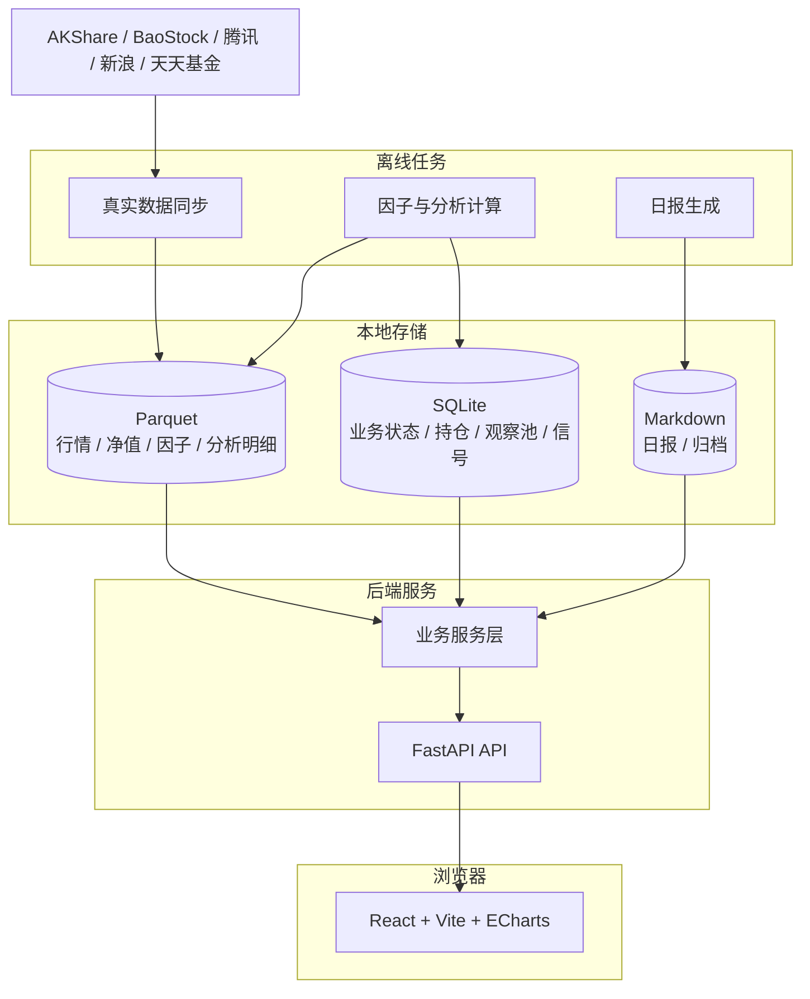
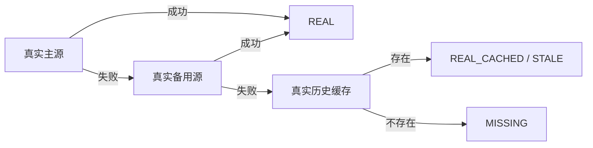
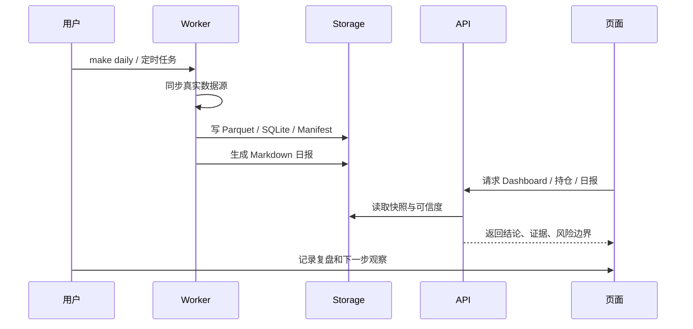

# Personal Invest

本地个人投资研究与复盘系统。它把 **真实数据采集、投资工作台、持仓风险、观察池、策略信号、复盘任务、投资日报** 放在一个浏览器工作流里。

系统只做研究、提醒、复盘和辅助判断，**不做自动交易，不连接券商下单，不承诺收益**。

## 快速入口

| 你要做什么 | 入口 |
|---|---|
| 快速启动项目 | [快速启动](#快速启动) |
| 理解系统能做什么 | [支持的功能](#支持的功能) / [`docs/feature-matrix.md`](docs/feature-matrix.md) |
| 学会页面怎么用 | [`docs/user-guide.md`](docs/user-guide.md) |
| 理解真实数据源和降级策略 | [`docs/data-sources.md`](docs/data-sources.md) |
| 理解系统限制 | [`docs/limitations.md`](docs/limitations.md) |
| 理解成本、风险和取舍 | [`docs/cost-and-risk.md`](docs/cost-and-risk.md) |
| 查看 API 能力 | [`docs/api.md`](docs/api.md) |
| 开发、部署、运维 | [`docs/development.md`](docs/development.md) |
| 生产排障和发布检查 | [`docs/operations-runbook.md`](docs/operations-runbook.md) / [`docs/release-checklist.md`](docs/release-checklist.md) |
| 查看全部文档 | [`docs/README.md`](docs/README.md) |
| 查看当前任务 | [`docs/task-board.md`](docs/task-board.md) |

## 系统定位

Personal Invest 的核心目标是帮助个人投资者每天回答四个问题：

1. **今天市场环境如何？** 是否适合进攻、防守或观望。
2. **我的组合最大风险在哪里？** 哪些持仓需要优先复核。
3. **观察池里哪些资产值得继续研究？** 哪些缺数据、低优先级或已经失效。
4. **今天发生了什么，明天先看什么？** 用日报和复盘形成闭环。


## 支持的功能

| 模块 | 当前能力 | 入口页面 |
|---|---|---|
| 今日工作台 | 数据状态、今日结论、需要关注、明日关注、下钻入口 | Dashboard |
| 市场趋势 | 市场评分、趋势、宽度、量能和状态解释 | 市场趋势 |
| 行业强弱 | 行业热力、轮动、强弱分层 | 行业强弱 |
| 股票研究 | 趋势、估值、财务、质量、风险边界、研究结论 | 股票研究 |
| 基金 / ETF 研究 | 净值、收益回撤、波动、基金画像、ETF 跟踪风险 | 基金研究 |
| 观察池 | 研究状态分层、待补数据、重点研究、失效关注 | 观察池 |
| 持仓 | 仓位、盈亏、集中度、组合暴露、优先复核 | 持仓 |
| 策略信号 | 策略信号、分级建议、风险提示 | 策略信号 |
| 策略配置 | 调整趋势、风控、建议阈值 | 策略配置 |
| 回测 | 对观察池做基础历史验证 | 回测 |
| 复盘 | 复盘任务、决策记录、结果跟踪 | 复盘 |
| 日报 | 今日投资简报、Markdown 报告归档 | 日报 |
| AI 分析 | 基于已有规则和数据做解释，不绕过风控 | AI 分析 |
| 设置 | 数据源、数据可信度、UI 偏好、阈值配置 | 设置 |

完整状态、数据依赖和限制见 [`docs/feature-matrix.md`](docs/feature-matrix.md)。

## 技术架构



技术栈：

| 层 | 技术 |
|---|---|
| 后端 | FastAPI |
| 前端 | React + Vite + TypeScript + ECharts |
| Python 依赖 | uv |
| 前端依赖 | Corepack + pnpm |
| 存储 | SQLite + Parquet + DuckDB |
| 数据任务 | Python worker |
| 报告 | Markdown |
| 生产运行 | systemd / 静态前端 / FastAPI |

详细架构见 [`docs/architecture.md`](docs/architecture.md)。

## 数据策略

系统运行时执行 **real-only** 策略：开发和线上都只使用真实数据、真实历史缓存或缺失态。



允许：

- `REAL`：当前同步成功的真实源数据。
- `REAL_CACHED` / `akshare_cached`：真实历史缓存，可以展示，但不能驱动高置信当日建议。
- `STALE`：真实数据过期，可以展示风险。
- `MISSING`：没有真实数据，页面必须明确提示。

禁止：

- 真实源失败后生成 `sample` / `mock` / `demo`。
- 用 `estimated` / `deterministic_estimate` 冒充真实运行时数据。
- 在建议、报告或页面中把历史样本污染当作正常状态。

数据源、provider 顺序、探针和限制见 [`docs/data-sources.md`](docs/data-sources.md) 与 [`docs/data-pipeline.md`](docs/data-pipeline.md)。

## 快速启动

前置依赖：

```bash
uv --version
node --version
corepack --version
```

启用 pnpm：

```bash
corepack enable
corepack prepare pnpm@latest --activate
pnpm --version
```

本地启动：

```bash
cp .env.example .env
make setup
make dev
```

访问：

```text
前端：http://localhost:5173
后端：http://localhost:8000
```

服务器开发：

```bash
cp .env.server.example .env.server
make doctor-server
make dev:server
```

生产模式：

```bash
make prod-server
```

更多启动、生产部署和 Cloudflare Access 边界见 [`docs/development.md`](docs/development.md)。

## 常用命令

```bash
make setup                 # 安装依赖并初始化 SQLite
make dev                   # 本地启动后端 + 前端
make dev:server            # 使用 .env.server 启动开发服务
make backend               # 只启动 FastAPI
make frontend              # 只启动 React/Vite
make init                  # 初始化 SQLite
make daily                 # 执行每日任务，生成日报
make check                 # Python 编译检查 + 前端构建
make doctor                # 检查本地环境
make doctor-server         # 检查服务器环境
make prod-server           # 服务器生产模式启动
make prod-restart          # 重启 systemd 后端和前端
make backup                # 备份数据
```

数据源探针：

```bash
PYTHONDONTWRITEBYTECODE=1 uv run --extra data python scripts/probe_market_sources.py --timeout 8 --days 30
```

real-only 审计：

```bash
uv run python scripts/audit_real_only.py
uv run python scripts/purge_non_real_data.py          # dry-run
uv run python scripts/purge_non_real_data.py --apply  # 显式清理
```

## 每日工作流



## 目录结构

```text
personal-invest/
├── backend/           # FastAPI API 与服务层
├── frontend/          # React/Vite 前端工作台
├── worker/            # 数据同步、因子计算、策略、报告任务
├── scripts/           # 初始化、启动、检查、审计、探针脚本
├── storage/           # SQLite / DuckDB 文件
├── data/              # raw / parquet / tmp 数据目录
├── reports/           # daily / weekly 报告归档
└── docs/              # 产品、架构、数据、任务和运维文档
```

## 关键限制

- 不是自动交易系统，不连接券商，不下单。
- 免费公开数据源可能超时、限流、字段变化或临时不可用。
- `REAL_CACHED` 只能作为真实历史参考，不能驱动高置信当日建议。
- 当前是个人单机系统，不适合多用户 SaaS 或高并发协作。
- AI 分析只能解释已有数据和规则，不能绕过风控。

完整边界见 [`docs/limitations.md`](docs/limitations.md)。

## 文档索引

| 文档 | 说明 |
|---|---|
| [`docs/user-guide.md`](docs/user-guide.md) | 页面使用手册和每日操作流程 |
| [`docs/feature-matrix.md`](docs/feature-matrix.md) | 功能矩阵、状态、数据依赖和限制 |
| [`docs/data-sources.md`](docs/data-sources.md) | 数据源、provider chain、探针和降级策略 |
| [`docs/limitations.md`](docs/limitations.md) | 投资、数据、架构、安全和运维限制 |
| [`docs/cost-and-risk.md`](docs/cost-and-risk.md) | 成本结构、免费源风险和商业取舍 |
| [`docs/architecture.md`](docs/architecture.md) | 技术架构、模块边界、数据流 |
| [`docs/api.md`](docs/api.md) | API 分组、读写边界和使用示例 |
| [`docs/development.md`](docs/development.md) | 本地开发、服务器启动、生产部署 |
| [`docs/operations-runbook.md`](docs/operations-runbook.md) | 生产运维、备份恢复、排障流程 |
| [`docs/release-checklist.md`](docs/release-checklist.md) | 提交、发布、部署前检查清单 |
| [`docs/storage.md`](docs/storage.md) | SQLite / DuckDB / Parquet 存储边界 |
| [`docs/task-board.md`](docs/task-board.md) | 当前任务看板 |

全部文档见 [`docs/README.md`](docs/README.md)。
