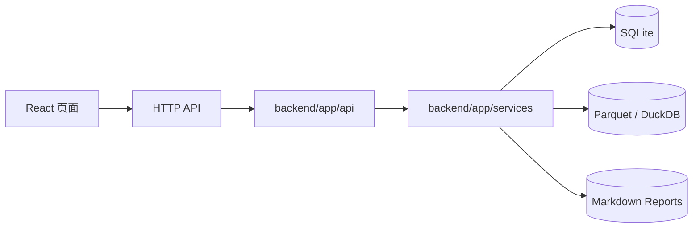
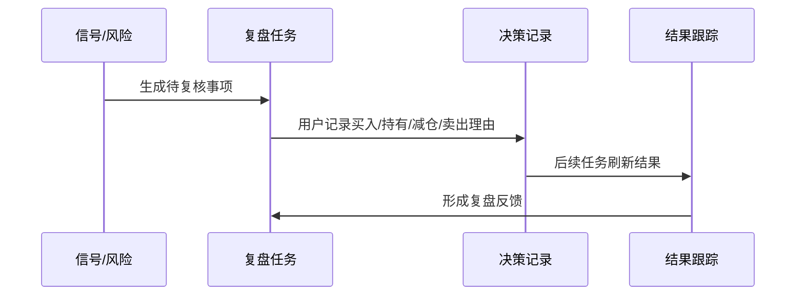

# API 总览

本文面向开发和集成排障，说明后端 API 的功能分组、主要路径、读写边界和使用方式。完整字段以 FastAPI 自动生成的 OpenAPI 为准。

```text
本地开发：http://localhost:8000/docs
服务器环境：https://api.chalme.indevs.in/docs
```

## API 分层



约束：

- API 不直接访问外部行情源；外部数据由 worker 同步后写入本地存储。
- API 返回的是当前本地快照、可信度、报告和用户录入状态。
- 投资建议和 AI 分析只解释已有数据和规则，不绕过 real-only 可信度边界。

## 基础接口

| 路径 | 方法 | 说明 | 页面 |
|---|---:|---|---|
| `/api/dashboard` | GET | 今日工作台汇总 | Dashboard |
| `/api/data/credibility` | GET | 数据可信度、freshness、provider 状态 | Dashboard / 设置 |
| `/api/settings` | GET | 获取用户设置 | 设置 |
| `/api/settings` | PUT | 更新用户设置 | 设置 |
| `/api/settings/reset` | POST | 重置用户设置 | 设置 |
| `/api/jobs` | GET | 任务执行记录 | 设置 / 运维 |
| `/api/jobs/daily` | POST | 创建每日任务记录 | 运维 |
| `/api/jobs/{job_id}` | GET | 查询任务详情 | 运维 |

## 市场与行情

| 路径 | 方法 | 说明 |
|---|---:|---|
| `/api/market/data-source` | GET | 行情数据源状态 |
| `/api/market/trend` | GET | 最新市场趋势快照 |
| `/api/market/trend/history` | GET | 市场趋势历史 |
| `/api/market/sectors` | GET | 行业强弱快照 |
| `/api/market/sectors/panorama` | GET | 行业全景 |
| `/api/market/sectors/history` | GET | 行业趋势历史 |
| `/api/prices/{symbol}/prices` | GET | 标的价格序列 |

数据依赖：

```text
worker/ingest/market_data.py
worker/market/*
data/parquet/daily_bar
market_trend_snapshot
sector_trend_snapshot
```

限制：行情接口只读取本地同步结果；如果真实源失败且没有真实历史缓存，返回缺失态，而不是 sample。

## 股票研究

| 路径 | 方法 | 说明 |
|---|---:|---|
| `/api/stocks/analysis` | GET | 股票分析列表或指定股票分析 |
| `/api/stocks/{symbol}/financial` | GET | 指定股票财务、估值、质量、事件 |
| `/api/stocks/financial/summary` | GET | 财务数据覆盖概览 |

主要数据表：

```text
stock_analysis_snapshot
financial_statement_snapshot
financial_metric_snapshot
valuation_snapshot
stock_quality_snapshot
financial_event
```

限制：没有真实财务源时，页面应展示缺失边界；不能用估算值冒充真实财报。

## 基金与 ETF

| 路径 | 方法 | 说明 |
|---|---:|---|
| `/api/funds/analysis` | GET | 基金 / ETF 分析列表或指定分析 |
| `/api/funds/{symbol}/nav` | GET | 基金净值序列 |
| `/api/funds/{symbol}/deep` | GET | 场外基金深度画像 |
| `/api/funds/{symbol}/etf` | GET | ETF 深度分析 |

主要数据：

```text
data/parquet/fund_nav
fund_analysis_snapshot
fund_profile
fund_risk_return_snapshot
fund_benchmark_snapshot
fund_peer_rank_snapshot
fund_holding_exposure_snapshot
etf_profile
etf_exposure_snapshot
etf_liquidity_snapshot
etf_risk_return_snapshot
etf_tracking_snapshot
```

限制：ETF 和场外基金不套用股票财报口径；缺真实画像源时必须显示缺失或低置信边界。

## 观察池与持仓

| 路径 | 方法 | 说明 |
|---|---:|---|
| `/api/watchlist` | GET | 查询观察池，可按资产类型过滤 |
| `/api/watchlist` | POST | 新增观察资产 |
| `/api/watchlist/{symbol}` | DELETE | 移除观察资产 |
| `/api/portfolio/positions` | GET | 持仓列表 |
| `/api/portfolio/positions` | POST | 新增或更新持仓 |
| `/api/portfolio/positions/{symbol}` | DELETE | 删除持仓 |
| `/api/portfolio/overview` | GET | 组合概览、集中度、风险摘要 |

写入边界：这些接口会修改 SQLite 中的人工业务状态。生产使用前建议先备份。

## 策略、信号与回测

| 路径 | 方法 | 说明 |
|---|---:|---|
| `/api/signals` | GET | 最新策略信号 |
| `/api/signals/{symbol}` | GET | 指定标的信号历史 |
| `/api/strategies` | GET | 策略配置列表 |
| `/api/strategies/{strategy_code}` | GET | 单个策略配置 |
| `/api/strategies/{strategy_code}` | PUT | 更新策略配置 |
| `/api/strategies/{strategy_code}/reset` | POST | 重置策略配置 |
| `/api/backtests/watchlist` | GET | 观察池基础回测 |

限制：当前回测是轻量验证，不是专业交易级回测引擎。

## 复盘与决策

| 路径 | 方法 | 说明 |
|---|---:|---|
| `/api/review/overview` | GET | 复盘总览 |
| `/api/review/tasks` | GET | 复盘任务列表 |
| `/api/review/tasks/generate` | POST | 生成复盘任务 |
| `/api/review/tasks/{task_id}` | PATCH | 更新复盘任务状态 |
| `/api/review/decisions` | GET | 决策记录列表 |
| `/api/review/decisions` | POST | 新增决策记录 |
| `/api/review/decisions/{decision_id}/outcomes` | GET | 单个决策结果跟踪 |
| `/api/review/outcomes` | GET | 决策结果列表 |

业务闭环：



## 报告与 AI 解释

| 路径 | 方法 | 说明 |
|---|---:|---|
| `/api/reports/daily` | GET | 日报列表 |
| `/api/reports/daily/latest` | GET | 最新日报 |
| `/api/reports/daily/{report_date}` | GET | 指定日期日报 |
| `/api/ai/market` | GET | 市场解释 |
| `/api/ai/portfolio` | GET | 组合解释 |
| `/api/ai/stock?symbol=...` | GET | 股票解释 |
| `/api/ai/fund?symbol=...` | GET | 基金解释 |
| `/api/ai/etf?symbol=...` | GET | ETF 解释 |

AI 限制：当前是规则解释层，不负责联网搜索、不生成交易指令、不覆盖数据可信度判断。

## 使用示例

```bash
curl http://localhost:8000/api/dashboard
curl http://localhost:8000/api/data/credibility
curl "http://localhost:8000/api/stocks/analysis?symbol=600519.SH"
curl http://localhost:8000/api/reports/daily/latest
```

更新持仓示例：

```bash
curl -X POST http://localhost:8000/api/portfolio/positions \
  -H 'Content-Type: application/json' \
  -d '{
    "symbol": "510300.SH",
    "name": "沪深300ETF",
    "asset_type": "ETF",
    "quantity": 1000,
    "avg_cost": 3.8,
    "current_price": 3.95
  }'
```

## 兼容性与稳定性

- API 路由当前主要服务前端页面，不承诺外部长期稳定契约。
- 写接口没有多用户权限模型；生产环境应通过 Cloudflare Access 或反向代理保护。
- 字段可能随任务迭代变化，正式集成前应以 `/docs` 自动 schema 为准。
- 数据缺失不是异常；real-only 策略下，缺失优先于伪造。
