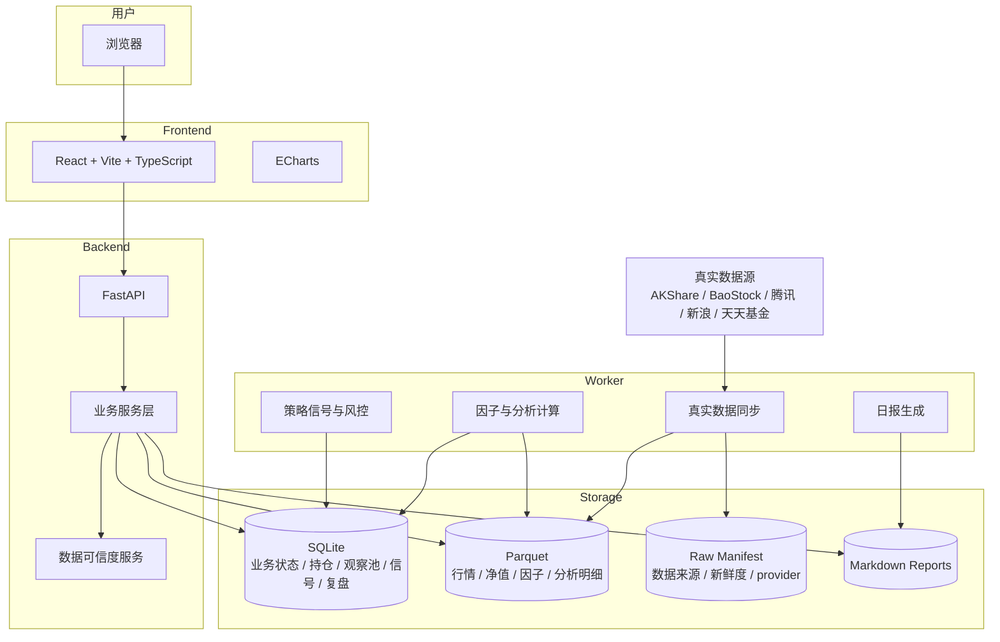
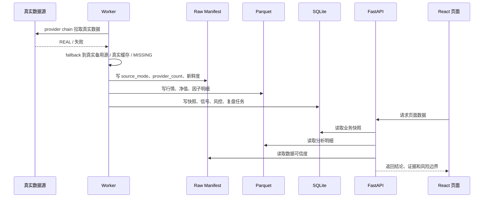
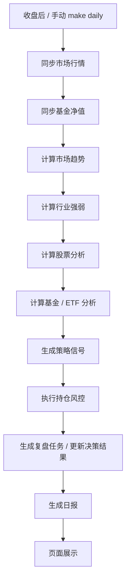
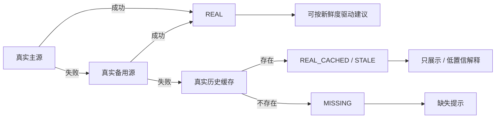

# 技术架构

Personal Invest 是个人单机优先的投资研究工作台。架构目标不是大规模并发，而是 **真实数据可信、页面结论清晰、每日流程可复盘、部署和维护成本低**。

## 总体结构



## 技术栈

| 层 | 技术 | 选择原因 |
|---|---|---|
| 前端 | React + Vite + TypeScript | 开发快、交互清晰、构建简单 |
| 图表 | ECharts | 金融图表和趋势展示友好 |
| 后端 | FastAPI | Python 数据生态友好，API 简洁 |
| 数据任务 | Python worker | 适合日频同步、计算和报告生成 |
| 业务状态 | SQLite | 单机可靠、易备份、部署简单 |
| 分析明细 | Parquet | 适合行情、净值、因子等列式历史数据 |
| 分析查询 | DuckDB | 本地分析查询友好 |
| 报告 | Markdown | 可读、可归档、可 diff |
| Python 依赖 | uv | 环境可重复、安装快 |
| 前端依赖 | Corepack + pnpm | 统一包管理器，避免 npm/pnpm 混用 |

## 模块边界

| 模块 | 职责 | 不负责 |
|---|---|---|
| Dashboard | 聚合今日结论、数据状态、风险和下钻入口 | 详细分析和配置 |
| Market | 市场趋势、宽度、指数状态 | 个股买卖判断 |
| Sector | 行业强弱、轮动、热力 | 行业基本面深度研究 |
| Stocks | 股票研究、财务、估值、风险边界 | 基金/ETF 专属分析 |
| Funds | 基金净值、基金画像、ETF 深度指标 | 股票公司分析 |
| Watchlist | 管理研究队列和资产状态 | 表示买入清单 |
| Portfolio | 持仓、仓位、集中度、组合风险 | 券商账户同步或下单 |
| Signals | 策略信号、分级建议、风险提示 | 自动交易执行 |
| Review | 决策记录、结果跟踪、复盘任务 | 替代人工判断 |
| Reports | 日报生成和归档 | 保证投资收益 |
| Settings | 数据可信度、配置、UI 偏好 | 修复外部数据源本身 |

股票、ETF 和场外基金的业务定义以 [`business-information-architecture.md`](business-information-architecture.md) 为准。

## 数据流



## 每日任务流



## real-only 数据边界



禁止在运行时生成或依赖：

- sample。
- mock。
- demo。
- estimated。
- deterministic estimate。

## 一致性底线

1. raw manifest 记录数据来源、provider、数据日期和新鲜度。
2. Parquet 写入必须避免半写状态，后续应优先采用 tmp + rename。
3. 策略信号必须能追溯数据日期和规则依据。
4. 报告必须记录生成时间、数据日期和可信边界。
5. 回测禁止未来函数。
6. AI 只能解释已有数据和规则建议，不能直接下单。
7. 页面必须展示数据日期、来源和不可驱动建议的原因。
8. 股票、ETF、场外基金必须有明确 `asset_type`，不能混用分析口径。
9. 缺真实数据时显示 `MISSING`，不能为了页面完整生成假数据。

## 运行形态

| 形态 | 命令 | 用途 |
|---|---|---|
| 本地开发 | `make dev` | 前后端热开发 |
| 服务器开发 | `make dev:server` | 使用 `.env.server` 和服务器域名 |
| 生产模式 | `make prod-server` | 构建前端并启动生产服务 |
| systemd 重启 | `make prod-restart` | 重启生产后端和前端 |
| 每日任务 | `make daily` | 同步数据、计算分析、生成日报 |
| 检查 | `make check` | Python 编译检查 + 前端构建 |

## 任务文档分层

```text
docs/product-backlog.md     长期产品需求池
docs/operation-backlog.md   长期运维需求池
docs/task-board.md          当前执行看板
docs/tasks/*.md             复杂任务详情页
```
