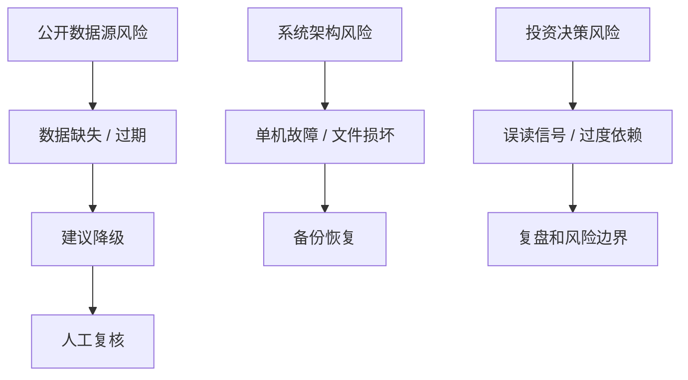

# 成本与风险

本文说明当前系统的成本结构、数据源风险、技术取舍和商业边界。

## 成本结构

当前系统按个人本地/个人服务器设计，默认成本较低。

| 成本项 | 当前策略 | 说明 |
|---|---|---|
| 服务器 | 用户自有本机或 VPS | 主要成本来自运行环境本身 |
| 数据源 | 免费公开源优先 | AKShare、BaoStock、腾讯、天天基金等公开接口 |
| 数据库 | 本地 SQLite / Parquet | 无托管数据库成本 |
| 前端托管 | 本地静态服务 / 自有服务器 | 不依赖 Vercel / Netlify |
| 访问保护 | 推荐 Cloudflare Access | 取决于用户已有配置和套餐 |
| AI | 当前以规则解释为主 | 不强依赖外部 LLM API |
| 运维 | 用户自维护 | 需要自己处理备份、服务重启和域名 |

## 免费数据源的真实代价

免费公开源没有直接费用，但有稳定性成本。

| 风险 | 表现 | 系统处理 |
|---|---|---|
| 限流 / 反爬 | 远端断开、超时、空数据 | 切换真实备用源 |
| 字段变化 | 解析失败、字段缺失 | provider 标准化和 `missing_fields` |
| 更新延迟 | 最新交易日缺失 | 新鲜度降级为 `STALE` |
| 源不可用 | 全部 provider 失败 | 真实缓存或 `MISSING` |
| 口径差异 | 不同源 amount / volume 含义不同 | 保留 provider 元数据，不伪造字段 |

核心取舍：

```text
低成本免费源
  换来
更高的数据源治理复杂度和更弱的可用性保证
```

## 为什么不直接接付费源

付费源可以提升稳定性和字段质量，但会引入：

- token / 账号管理。
- 授权和使用条款边界。
- 开发和线上环境配置差异。
- 成本决策。
- SLA 与供应商绑定。

当前更合适的阶段性策略：

```text
免费真实源多源 fallback
  -> 可选付费源插件化
  -> 用户明确配置 token 后启用
```

## 技术取舍

| 选择 | 为什么 | 代价 |
|---|---|---|
| SQLite | 单机简单、易备份、低成本 | 不适合多人高并发 |
| Parquet | 分析友好、压缩好、适合历史明细 | 文件写入需要谨慎管理 |
| FastAPI | Python 数据生态友好 | 高并发需要额外部署优化 |
| React + Vite | 开发快、交互体验好 | 前端构建依赖 Node/pnpm |
| worker 脚本 | 易理解、易调试 | 不如完整任务队列健壮 |
| Markdown 日报 | 可归档、可读、可 diff | 不如数据库化报告灵活 |
| real-only | 投资数据可信 | 页面可能显示缺失，不如 sample 演示完整 |

## 风险模型



## 商业可行性判断

当前项目适合的价值定位：

- 个人投资研究工作台。
- 本地数据和复盘沉淀。
- 每日投资流程纪律化。
- 低成本真实数据探索。

不适合当前阶段做：

- 面向外部用户收费的 SaaS。
- 持牌投顾产品。
- 自动交易系统。
- 高可用金融数据服务。

如果未来商业化，需要补齐：

| 能力 | 原因 |
|---|---|
| 付费数据授权 | 免费源不适合商业 SLA |
| 用户体系和权限 | 多用户必需 |
| 审计日志 | 合规和追责必需 |
| 安全加固 | 账户、资产、配置保护 |
| 服务监控 | 可用性和故障响应 |
| 法务边界 | 投资建议和数据版权边界 |

## 运维成本

最低运维动作：

```text
每日：检查 Dashboard 数据状态和日报
每周：备份 storage/data/reports
每月：检查依赖、数据源探针、磁盘空间
发生异常：先看 Settings 数据可信度，再跑 probe_market_sources
```

## 成本优化建议

1. 保持单机架构，直到确实需要多人使用。
2. 免费源优先，但必须保留 `MISSING` 边界。
3. 付费源只做可选 provider，不作为默认硬依赖。
4. 备份优先级高于复杂监控。
5. 不要为了页面完整恢复 sample。

## 最重要的边界

```text
省钱不能以牺牲数据真实性为代价。
系统可以缺数据，但不能造数据。
```
