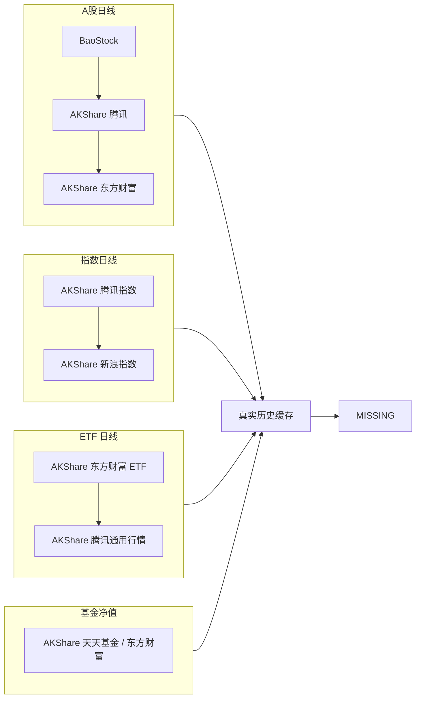
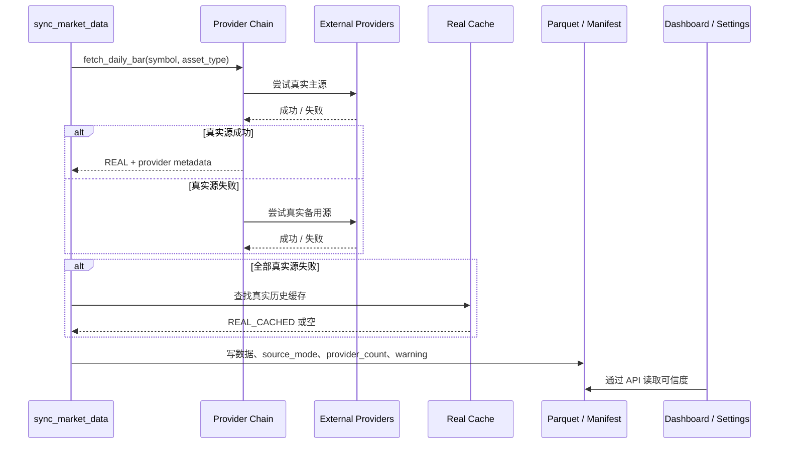

# 数据源说明

本文说明系统使用哪些真实数据源、在哪里使用、失败后如何降级，以及如何做只读探针。

## 核心原则

```text
数据源可以 fallback，数据真实性不能 fallback。
```

允许链路：

```text
真实主源 -> 真实备用源 -> 真实历史缓存 -> MISSING
```

禁止链路：

```text
真实源失败 -> sample / mock / demo / estimated
```

## Provider Chain



## 数据源定位

| 数据源 | 用途 | 优点 | 限制 |
|---|---|---|---|
| AKShare 东方财富 | A股、ETF、基金净值等公开接口 | 覆盖广，接入简单 | 公开接口可能断连、限流或字段变化 |
| AKShare 腾讯 | A股、指数、ETF 真实 fallback | 当前环境中部分接口更稳定 | 字段少于东方财富，不能伪造缺失字段 |
| AKShare 新浪 | 指数 fallback | 可作为指数备用源 | 接口返回结构可能变化 |
| BaoStock | A股历史日线和估值字段补强 | 字段较完整，适合 A股历史 | 不作为基金、ETF 深度或实时行情主源 |
| 天天基金 / 东方财富基金 | 场外基金净值 | 历史净值覆盖较长 | 接口可能较慢，需要 timeout / retry |
| Local Real Cache | 上次成功同步的真实历史数据 | 保留真实历史参考 | 不新鲜，不能驱动高置信建议 |

## source 状态语义

| 状态 | 含义 | 是否展示 | 是否可驱动高置信建议 |
|---|---|---:|---:|
| `REAL` | 当前同步成功的真实源数据 | 是 | 取决于新鲜度 |
| `REAL_CACHED` / `akshare_cached` | 真实历史缓存 | 是 | 否 |
| `STALE` | 真实数据过期 | 是，需提示 | 否 |
| `MISSING` | 没有真实数据 | 是，作为缺失提示 | 否 |
| `SAMPLE` / `ESTIMATED` | 历史污染或测试态 | 不作为运行时正常数据 | 否 |

## 当前系统在哪里使用数据源

| 使用位置 | 文件 / 命令 | 说明 |
|---|---|---|
| 行情同步 | `worker/ingest/market_data.py` | 执行市场日线同步，写 Parquet 和 manifest |
| Provider 抽象 | `worker/ingest/market_providers.py` | 真实源 provider chain、字段标准化、fallback |
| 基金净值 | `sync_fund_data()` | 读取基金净值并写 `fund_nav` |
| 数据可信度 | `backend/app/services/data_credibility_service.py` | 读取 manifest / Parquet / SQLite，判断新鲜度和来源 |
| 设置页 | `frontend/src/pages/SettingsPage.tsx` | 展示数据集、source、provider、warning |
| Dashboard | `frontend/src/pages/Dashboard.tsx` | 展示今日数据状态和是否可驱动建议 |
| 健康探针 | `scripts/probe_market_sources.py` | 只读检查外部真实源是否可访问 |

## 同步时的数据流



## 字段边界

不同 provider 返回字段不完全一致。统一规则：

1. 真实源返回了字段，才写入对应字段。
2. 真实源没返回的字段必须记入 `missing_fields` 或置空。
3. 可以从真实字段直接计算的指标，需要标记为 derived。
4. 不能用估算值伪造成真实成交额、换手率、估值或财务字段。

常见字段差异：

| 字段 | 东方财富 | 腾讯 | BaoStock | 处理方式 |
|---|---:|---:|---:|---|
| OHLC | 有 | 有 | 有 | 正常写入 |
| volume | 有 | 可能口径不同 | 有 | 保留 provider 口径 |
| amount | 有 | 有 | 有 | 不同口径需标注 provider |
| turn | 有 | 缺失 | 有 | 缺失则置空 |
| pctChg | 有 | 可由真实 close 派生 | 有 | 可标记 derived |
| pe / pb | 部分有 | 缺失 | 有 | 只写真实源提供值 |

## 如何检查数据源是否可用

只读探针：

```bash
PYTHONDONTWRITEBYTECODE=1 uv run --extra data python scripts/probe_market_sources.py --timeout 8 --days 30
```

用途：

- 检查 AKShare / BaoStock 等依赖是否安装。
- 检查外部真实源当前是否可访问。
- 输出每个 provider 的状态、行数、最新日期、错误类型和耗时。
- 不写 SQLite、Parquet 或 manifest。

## 如何同步真实数据

安装真实数据源依赖：

```bash
uv sync --extra data
```

执行每日任务：

```bash
make daily
```

输出：

```text
data/raw/*_manifest.json
data/parquet/*
storage/invest.db
reports/daily/YYYY-MM-DD.md
```

## 失败处理

| 场景 | 正确行为 |
|---|---|
| 主源超时 | 尝试真实备用源 |
| 所有真实源失败，有历史真实数据 | 复用真实缓存，标记 `REAL_CACHED` / `STALE` |
| 所有真实源失败，无历史真实数据 | 标记 `MISSING` |
| 发现历史 sample / estimated | 审计并清理，不作为正常数据 |
| 页面需要展示结论 | 同时展示数据日期、来源和可信边界 |

## 不做什么

- 不为了页面完整生成 sample。
- 不使用 mock/demo 数据进入运行目录。
- 不接券商交易接口。
- 不保证免费公开源长期可用。
- 不把免费源失败解释为投资结论。
