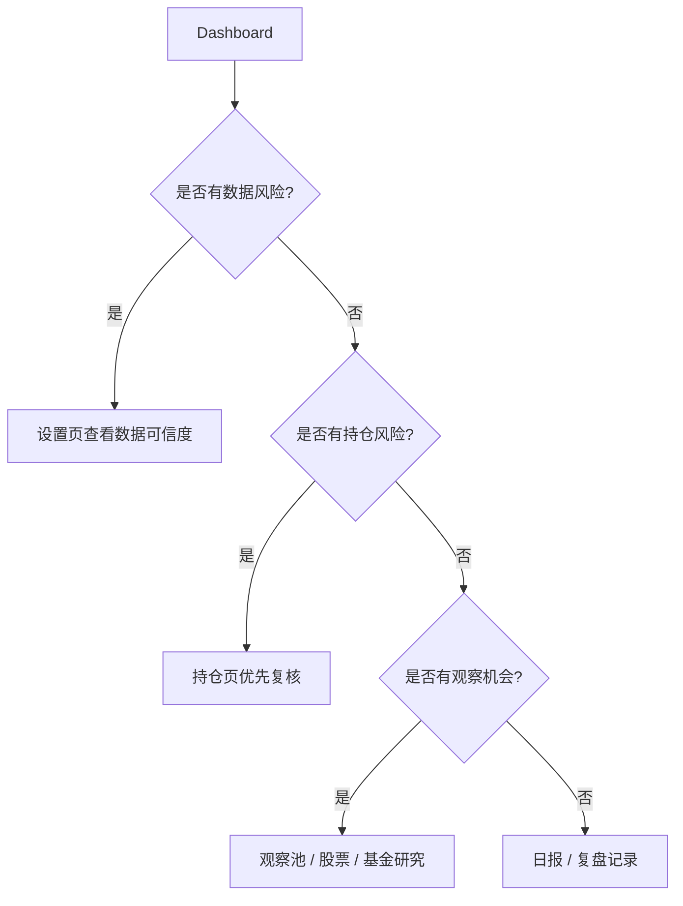

# 功能矩阵

本文说明系统当前支持哪些功能、入口在哪里、依赖什么数据，以及主要限制。

## 状态定义

| 状态 | 含义 |
|---|---|
| `可用` | 已有页面、API 和基础数据链路，可日常使用 |
| `部分可用` | 主流程可用，但数据源、字段或交互仍有限制 |
| `规划中` | 已有任务或设计，但不应按稳定功能使用 |

## 页面功能矩阵

| 功能 | 状态 | 页面 | 依赖数据 | 主要限制 |
|---|---|---|---|---|
| 今日工作台 | 可用 | Dashboard | 数据可信度、市场、持仓、观察池、日报摘要 | 结论依赖数据新鲜度 |
| 数据可信度 | 可用 | 设置 | manifest、Parquet、SQLite 审计结果 | 交易日历第一版按工作日估算 |
| 市场趋势 | 可用 | 市场趋势 | 指数 / 市场宽度 / 日线 | 公开源失败时会降级为缓存或缺失 |
| 行业强弱 | 可用 | 行业强弱 | 行业因子 / 行业快照 | 行业真实源覆盖仍需持续增强 |
| 股票研究 | 部分可用 | 股票研究 | 日线、股票分析、财务快照、估值、质量 | 真实财报源覆盖不完整时显示缺失态 |
| 基金研究 | 部分可用 | 基金研究 | 基金净值、基金画像、风险收益 | 基金画像真实源仍有缺口 |
| ETF 研究 | 部分可用 | 基金研究 | ETF 行情、跟踪、流动性、风险收益 | 折溢价、规模、跟踪质量真实源仍需增强 |
| 观察池 | 可用 | 观察池 | instrument、watchlist、分析摘要 | 不等于买入清单 |
| 持仓 | 可用 | 持仓 | holdings、价格、风险快照 | 不连接券商账户，不自动同步真实成交 |
| 策略信号 | 可用 | 策略信号 | 市场、行业、资产分析、规则阈值 | 只产生观察和建议，不下单 |
| 策略配置 | 可用 | 策略配置 | 设置项、策略阈值 | 阈值调整需要复盘验证 |
| 回测 | 部分可用 | 回测 | 历史行情、观察池资产 | 基础回测，不是专业量化引擎 |
| 复盘任务 | 可用 | 复盘 | review_task、decision_record、decision_outcome | 需要用户人工记录和关闭任务 |
| 日报 | 可用 | 日报 | 当日快照、信号、风险、报告生成器 | 数据缺失时报告会降级提示 |
| AI 分析 | 部分可用 | AI 分析 | 现有规则和系统快照 | 只做解释，不做独立预测或交易指令 |
| 生产部署 | 可用 | 命令行 / systemd | `.env.server`、systemd、Cloudflare Access | 安全边界依赖外部访问保护配置 |

## 数据功能矩阵

| 数据能力 | 状态 | 主要实现 | 降级路径 | 限制 |
|---|---|---|---|---|
| A股日线 | 部分可用 | AKShare / Tencent / BaoStock provider chain | 真实缓存 -> `MISSING` | 免费公开源可能超时或字段变化 |
| 指数日线 | 部分可用 | AKShare Tencent / Sina | 真实缓存 -> `MISSING` | 指数接口稳定性需持续观察 |
| ETF 日线 | 部分可用 | AKShare Eastmoney / Tencent fallback | 真实缓存 -> `MISSING` | 字段完整度可能低于股票 |
| 基金净值 | 部分可用 | AKShare 天天基金 / 东方财富 | 真实缓存 -> `MISSING` | 接口可能较慢，需要 timeout / retry |
| 股票财务 | 部分可用 | 快照服务与缺失态 | `MISSING` | 不再用 sample/estimated 冒充真实财报 |
| 基金画像 | 部分可用 | 深度分析服务与缺失态 | `MISSING` | 经理、公司、同类等真实源仍需增强 |
| ETF 深度指标 | 部分可用 | ETF profile / tracking / liquidity 快照 | `MISSING` | 跟踪质量、折溢价、规模仍有真实源缺口 |
| 数据审计 | 可用 | `audit_real_only.py` | 不适用 | 应持续覆盖新增表和 manifest |
| 数据清理 | 可用 | `purge_non_real_data.py` | dry-run -> `--apply` | 只清非真实污染，不清全库 |
| 数据源探针 | 可用 | `probe_market_sources.py` | 不适用 | 只读诊断，不代表全天稳定性 |

## API 功能矩阵

| API 分组 | 代表路径 | 用途 |
|---|---|---|
| Dashboard | `/api/dashboard` | 今日工作台总览 |
| Market | `/api/market/trend`、`/api/market/sectors` | 市场趋势与行业强弱 |
| Stocks | `/api/stocks/analysis`、`/api/stocks/{symbol}/financial` | 股票研究和财务信息 |
| Funds | `/api/funds/analysis`、`/api/funds/{symbol}/nav`、`/api/funds/{symbol}/deep` | 基金 / ETF 研究 |
| Watchlist | `/api/watchlist` | 观察池管理 |
| Portfolio | `/api/portfolio/positions`、`/api/portfolio/overview` | 持仓和组合概览 |
| Signals | `/api/signals` | 策略信号 |
| Strategies | `/api/strategies` | 策略配置 |
| Backtests | `/api/backtests/watchlist` | 观察池回测 |
| Reports | `/api/reports/daily` | 日报列表和内容 |
| Review | `/api/review/*` | 复盘任务、决策记录、结果跟踪 |
| AI | `/api/ai/*` | 规则解释型 AI 分析 |
| Settings | `/api/settings` | 设置和 UI 偏好 |
| Data | `/api/data/credibility` | 数据可信度 |
| Jobs | `/api/jobs` | 任务状态 |

## 使用优先级

## 当前不支持

- 自动交易和券商下单。
- 多用户权限和团队协作。
- 对投资收益的任何保证。
- 高频行情、盘口级交易或实时风控。
- 完整付费数据源 SLA。
- 专业级量化回测、撮合和滑点模型。
