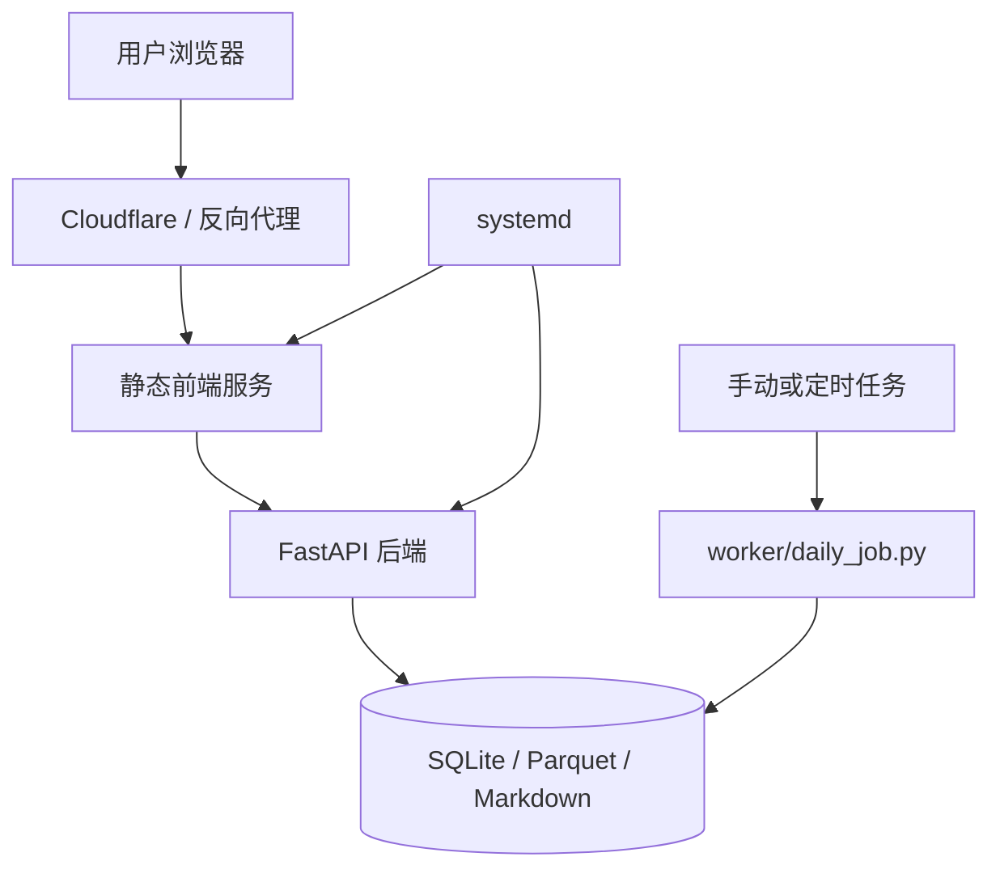
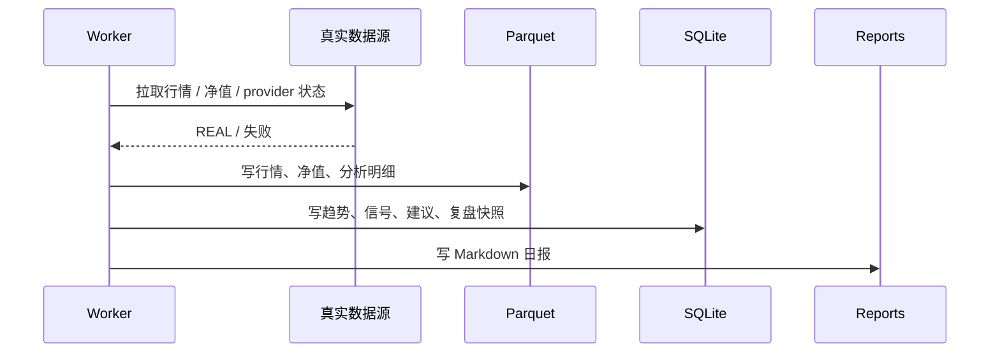

# 运维 Runbook

本文用于生产和服务器环境的日常操作、健康检查、备份恢复和故障排查。

## 运行结构



关键原则：

- 应用内不提供完整登录权限模型，生产访问应由 Cloudflare Access 或反向代理保护。
- 每日任务写本地数据；运行前最好保证没有同时执行另一个写入任务。
- 清理、迁移、real-only purge 必须先 dry-run，再备份，再 apply。

## 常用命令

| 场景 | 命令 |
|---|---|
| 检查本地环境 | `make doctor` |
| 检查服务器环境 | `make doctor-server` |
| 本地开发启动 | `make dev` |
| 服务器开发启动 | `make dev:server` |
| 生产启动 | `make prod-server` |
| 重启生产服务 | `make prod-restart` |
| 只重启后端 | `make prod-restart-backend` |
| 只重启前端 | `make prod-restart-frontend` |
| 每日任务 | `make daily` |
| 项目检查 | `make check` |
| 备份数据 | `make backup` |

## 健康检查

### 1. 服务状态

```bash
sudo systemctl status personal-invest-backend.service
sudo systemctl status personal-invest-frontend.service
```

### 2. 端口与 HTTP

```bash
make health-server
curl -f http://127.0.0.1:8000/api/dashboard
curl -f http://127.0.0.1:8000/api/data/credibility
```

### 3. 前端构建

```bash
pnpm -C frontend build
```

### 4. Python 编译

```bash
uv run python -m compileall backend/app worker scripts
```

## 每日任务运行

```bash
make daily
```

每日任务主要动作：



运行后建议检查：

```bash
uv run python scripts/audit_real_only.py
PYTHONDONTWRITEBYTECODE=1 uv run --extra data python scripts/probe_market_sources.py --timeout 8 --days 30
```

## 数据源探针

只读检查当前外部真实源是否可访问：

```bash
PYTHONDONTWRITEBYTECODE=1 uv run --extra data python scripts/probe_market_sources.py --timeout 8 --days 30
```

输出应关注：

```text
provider
interface
symbol
status
rows
latest_date
error_class
elapsed_ms
```

判断边界：

- 单个公开源失败不等于系统不可用。
- 东方财富失败时可以走腾讯 / BaoStock 等真实备用源。
- 所有真实源失败时应进入真实历史缓存或 `MISSING`，不能生成 sample。

## real-only 审计与清理

审计：

```bash
uv run python scripts/audit_real_only.py
```

清理 dry-run：

```bash
uv run python scripts/purge_non_real_data.py
```

真实清理：

```bash
make backup
uv run python scripts/purge_non_real_data.py --apply
uv run python scripts/audit_real_only.py
```

禁止：

```bash
rm -rf storage data
```

除非你明确要重置整个系统。正常治理应只清理 `sample/mock/demo/estimated` 污染，不删除真实缓存、持仓、观察池和设置。

## 备份与恢复

### 备份

```bash
make backup
```

至少应备份：

```text
storage/invest.db
data/raw/
data/parquet/
reports/
.env.server
```

`.env.server` 可能包含部署配置，不应提交到 Git。

### 恢复

建议流程：

```text
1. 停止后端和前端 systemd 服务
2. 备份当前损坏数据目录
3. 恢复 storage / data / reports
4. 运行 make doctor-server
5. 启动服务
6. 检查 /api/dashboard 与 /api/data/credibility
```

## 常见故障

### 前端页面打不开

检查：

```bash
sudo systemctl status personal-invest-frontend.service
pnpm -C frontend build
make health-server
```

可能原因：

- 前端静态服务未启动。
- 运行时 API 地址没有写入。
- Cloudflare / 反向代理路由错误。

### 后端 API 失败

检查：

```bash
sudo systemctl status personal-invest-backend.service
uv run python -m compileall backend/app worker scripts
curl -f http://127.0.0.1:8000/api/dashboard
```

可能原因：

- `.env.server` 配置缺失。
- SQLite 路径不可写。
- Python 依赖未安装。
- 迁移未执行。

### 页面显示大量 MISSING

优先判断数据源状态：

```bash
PYTHONDONTWRITEBYTECODE=1 uv run --extra data python scripts/probe_market_sources.py --timeout 8 --days 30
uv run python scripts/audit_real_only.py
```

可能原因：

- 真实源临时不可用。
- provider chain 尚未覆盖该资产类型。
- 没有真实历史缓存。
- 数据同步任务未运行。

这不是 sample 兜底的理由。系统应明确显示缺失。

### 页面仍出现 sample / mixed

处理顺序：

```text
1. 运行 audit_real_only.py
2. 检查 data/raw/*_manifest.json 是否残留旧 source_count.sample
3. 检查 SQLite 事件表 source_mode 是否仍有 SAMPLE / ESTIMATED
4. 执行 purge dry-run
5. 备份后 apply
6. 重新生成最新 manifest 或重新执行每日任务
```

### 数据源很慢或超时

判断：公开免费源可能限流、断连或返回字段变化。

处理：

- 先用探针确认是哪个 provider 失败。
- 降低同步频率。
- 缩小资产范围。
- 允许真实备用源或真实缓存接管。
- 不要恢复 sample fallback。

## 升级与回滚

升级建议：

```bash
git pull --ff-only
make check
make backup
make prod-restart
```

回滚建议：

```bash
git log --oneline -n 5
git checkout <last_good_commit>
make check
make prod-restart
```

如果升级包含数据库迁移，回滚前必须确认迁移是否可逆；不可逆迁移需要恢复备份。

## 运维边界

- 不建议多人同时写观察池、持仓和设置。
- 不建议在每日任务执行期间手工清理数据。
- 不建议直接编辑 SQLite，除非先备份并确认 SQL。
- 不建议把免费源失败当成系统故障；要看 provider chain 和缓存状态。
