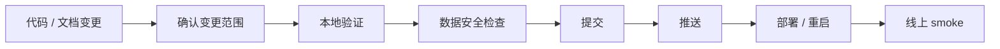

# 发布检查清单

本文用于提交、部署和数据任务前的最低检查。目标是避免把不完整实现、历史 sample 污染、前端构建失败或数据写入风险带到主线。

## 发布流程



## 1. 变更范围确认

```bash
git status --short
git diff --check
git diff --stat
```

确认：

- 文档任务只改 `README.md` / `docs/**`。
- 前端任务不混入数据清理。
- worker / backend 任务不混入无关 UI 重构。
- `data/`、`storage/`、`reports/` 的运行时数据不要误提交。

## 2. 代码验证

基础检查：

```bash
uv run python -m compileall backend/app worker scripts
pnpm -C frontend build
git diff --check
```

如果改了 Python 业务逻辑，追加：

```bash
uv run --extra dev ruff check backend/app worker scripts
```

如果改了数据源，追加：

```bash
PYTHONDONTWRITEBYTECODE=1 uv run --extra data python scripts/probe_market_sources.py --timeout 8 --days 30
```

如果改了 real-only 清理或同步逻辑，追加：

```bash
uv run python scripts/audit_real_only.py
uv run python scripts/purge_non_real_data.py
```

## 3. 数据安全检查

发布前确认：

```text
不会生成 sample / mock / demo / estimated 运行时数据
真实源失败最终进入 REAL_CACHED / STALE / MISSING
不会清空 SQLite / Parquet / reports
不会把 .env / .env.server 提交
不会把运行时备份提交
```

涉及清理时：

```bash
make backup
uv run python scripts/purge_non_real_data.py
uv run python scripts/purge_non_real_data.py --apply
uv run python scripts/audit_real_only.py
```

## 4. 文档检查

文档变更至少确认：

- README 索引能指向新增文档。
- `docs/README.md` 已同步索引。
- Mermaid 图语法简单、方向清晰。
- 不再出现“真实源失败后降级 sample”的当前策略表述。
- 历史任务文档中的旧口径不应作为当前策略引用。

推荐搜索：

```bash
rg -n "样本|sample|mock|demo|estimated|MIXED" README.md docs --glob '!docs/tasks/**'
```

允许出现：

```text
禁止 sample
历史污染
real-only 审计
```

不允许出现：

```text
失败时使用样本兜底
自动生成样本行情
仅样本数据作为正常模式
```

## 5. 提交规范

建议提交粒度：

| 类型 | 示例 |
|---|---|
| 文档 | `docs: improve product documentation` |
| 数据源 | `feat: add baostock astock provider` |
| UI | `feat: improve dashboard credibility display` |
| 修复 | `fix: prevent stale manifest sample display` |
| 清理 | `chore: remove deprecated akshare fetch path` |

不要把以下内容混进一个 commit：

```text
provider 接入 + 数据清理 + UI 重构 + 文档重写
```

## 6. 推送前检查

```bash
git status --short
git log --oneline -n 3
```

确认工作区干净后：

```bash
git push origin main
```

## 7. 部署后 smoke

```bash
make prod-restart
make health-server
curl -f http://127.0.0.1:8000/api/dashboard
curl -f http://127.0.0.1:8000/api/data/credibility
```

页面检查：

```text
Dashboard 可打开
设置页数据可信度可打开
观察池可读写
持仓可读写
日报最新报告可打开
```

## 8. 回滚判断

满足任一条件应优先回滚或暂停：

- 前端生产构建失败。
- 后端 API 无法启动。
- SQLite 迁移失败且没有备份。
- 运行时数据被误删。
- 页面把 sample / mixed 当作正常状态展示。
- 真实源失败后又生成了非真实数据。

## 最小验收线

普通代码变更至少通过：

```bash
git diff --check
uv run python -m compileall backend/app worker scripts
pnpm -C frontend build
```

文档-only 变更至少通过：

```bash
git diff --check
```
