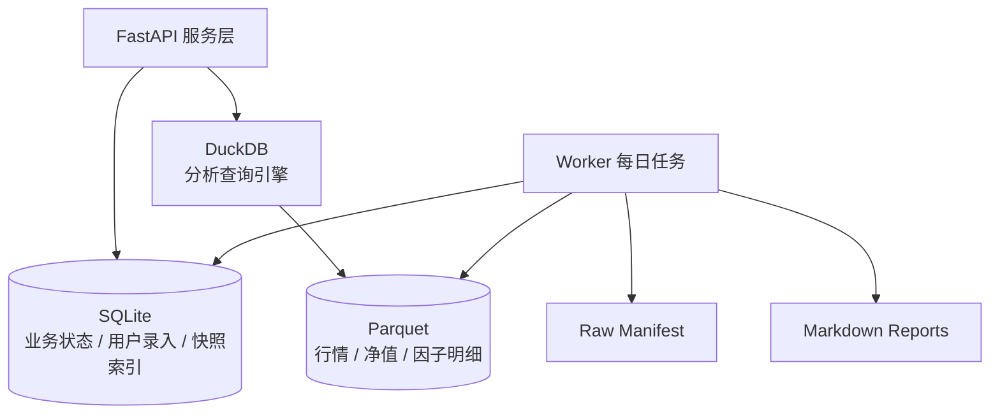
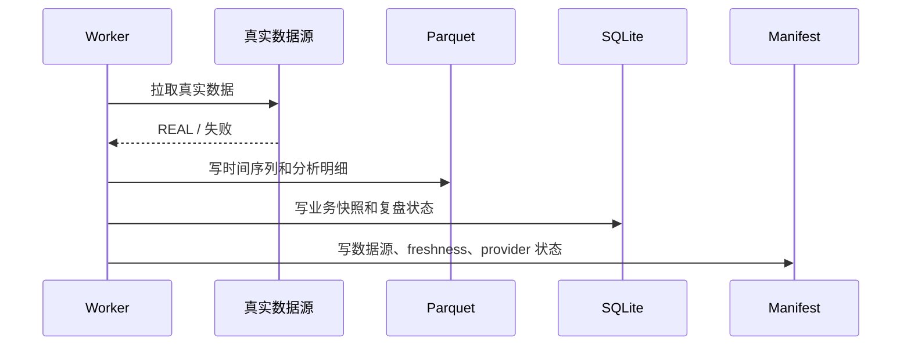

# 存储设计

Personal Invest 使用本地存储，优先保证个人系统的简单性、可备份性和可解释性。



## 存储分层

| 存储 | 路径 | 作用 | 是否人工编辑 |
|---|---|---|---:|
| SQLite | `storage/invest.db` | 业务状态、观察池、持仓、策略、快照、复盘、设置 | 不建议 |
| Parquet | `data/parquet/` | 行情、基金净值、分析明细、批量计算结果 | 否 |
| Raw / Manifest | `data/raw/` | 每次同步的数据来源、freshness、provider 状态 | 否 |
| Markdown | `reports/` | 日报归档 | 可读，不建议改历史 |
| DuckDB | `storage/*.duckdb` 或运行时连接 | 读取 Parquet 做聚合分析 | 否 |

## SQLite：业务状态库

SQLite 只保存小而重要、需要事务一致性的状态。当前 schema 由 `backend/migrations/*.sql` 管理。

### 基础与资产

| 表 | 说明 |
|---|---|
| `schema_migration` | 已执行迁移记录 |
| `instrument` | 资产主数据，统一股票 / ETF / 基金标的 |
| `instrument_sector_map` | 资产行业、主题、指数、地区、风格映射 |
| `watchlist` | 观察池 |
| `portfolio_position` | 当前持仓 |
| `portfolio_snapshot` | 组合历史快照 |
| `trade_record` | 交易记录 |
| `user_setting` | 用户配置 |

### 市场、行业和策略

| 表 | 说明 |
|---|---|
| `market_trend_snapshot` | 市场趋势快照 |
| `sector_trend_snapshot` | 行业趋势快照 |
| `strategy_config` | 策略配置 |
| `strategy_signal` | 策略信号 |
| `investment_advice` | 分级建议快照 |
| `risk_event` | 风险事件 |

### 股票分析

| 表 | 说明 |
|---|---|
| `stock_analysis_snapshot` | 股票综合分析快照 |
| `financial_statement_snapshot` | 财务报表摘要快照 |
| `financial_metric_snapshot` | 财务指标快照 |
| `valuation_snapshot` | 估值快照 |
| `stock_quality_snapshot` | 公司质量快照 |
| `financial_event` | 财报 / 估值 / 质量相关事件 |

### 基金分析

| 表 | 说明 |
|---|---|
| `fund_analysis_snapshot` | 基金综合分析快照 |
| `fund_profile` | 基金基础画像 |
| `fund_manager_profile` | 基金经理画像 |
| `fund_company_profile` | 基金公司画像 |
| `fund_risk_return_snapshot` | 基金风险收益快照 |
| `fund_benchmark_snapshot` | 基金基准比较快照 |
| `fund_peer_rank_snapshot` | 基金同类排名快照 |
| `fund_holding_exposure_snapshot` | 基金持仓暴露快照 |
| `fund_deep_event` | 基金深度分析事件 |

### ETF 分析

| 表 | 说明 |
|---|---|
| `etf_profile` | ETF 基础画像 |
| `etf_exposure_snapshot` | ETF 持仓 / 行业 / 风格暴露 |
| `etf_liquidity_snapshot` | ETF 流动性快照 |
| `etf_risk_return_snapshot` | ETF 风险收益快照 |
| `etf_tracking_snapshot` | ETF 跟踪质量快照 |
| `etf_deep_event` | ETF 深度分析事件 |

### 复盘、报告和任务

| 表 | 说明 |
|---|---|
| `review_task` | 复盘任务 |
| `decision_record` | 用户决策记录 |
| `decision_outcome` | 决策结果跟踪 |
| `report_index` | 报告索引 |
| `job_execution` | 任务执行记录 |
| `ai_analysis` | AI / 规则解释记录 |

## Parquet：分析明细库

Parquet 保存批量和时间序列数据，适合用 DuckDB 扫描、聚合、回测。

主要数据集：

| 数据集 | 路径 | 说明 |
|---|---|---|
| `daily_bar` | `data/parquet/daily_bar` | 股票 / 指数 / ETF 日线行情 |
| `fund_nav` | `data/parquet/fund_nav` | 场外基金净值 |
| `factor_value` | `data/parquet/factor_value` | 通用因子值 |
| `financial_indicator` | `data/parquet/financial_indicator` | 财务指标明细 |
| `market_breadth` | `data/parquet/market_breadth` | 市场宽度 |
| `sector_factor` | `data/parquet/sector_factor` | 行业因子 |
| `stock_factor` | `data/parquet/stock_factor` | 个股因子 |
| `strategy_result` | `data/parquet/strategy_result` | 策略结果 |
| `backtest_trade` | `data/parquet/backtest_trade` | 回测交易明细 |
| `backtest_position` | `data/parquet/backtest_position` | 回测持仓明细 |

字段要求：

- `source_mode` 表示真实性状态，如 `REAL`、`REAL_CACHED`、`MISSING`。
- `source_provider` 表示来源，如 `baostock`、`tencent`、`eastmoney`、`sina`。
- `source_interface` 表示具体接口，如 `stock_zh_a_hist_tx`。
- `missing_fields` 记录真实源未提供的字段。
- 禁止把缺失字段用估算值补成真实字段。

## Raw / Manifest：同步状态

`data/raw/` 保存同步批次的 manifest，用于描述数据源、freshness 和失败原因。

典型字段：

```text
dataset
latest_data_date
expected_latest_trade_date
freshness_status
stale_days
can_drive_advice
source_mode
source_count
provider_count
asset_source_status
warning
```

约束：

- manifest 是运行状态，不是投资事实本身。
- 如果 manifest 残留 `sample` / `MIXED`，应通过审计和重建修复。
- 页面不应把历史污染 manifest 当成当前正常状态。

## DuckDB：分析查询引擎

DuckDB 不做业务主库，只负责读取 Parquet 并做聚合分析。

用途：

- 全市场扫描
- 因子排序
- 行业强弱计算
- 回测统计
- 收益曲线
- 组合归因

设计边界：

- DuckDB 查询应是可重算的。
- 业务状态不要只写 DuckDB。
- SQLite 才是观察池、持仓、复盘、配置的主状态。

## 数据写入流程



## SQLite 配置

初始化 SQL 使用：

```sql
PRAGMA journal_mode = WAL;
PRAGMA synchronous = NORMAL;
PRAGMA busy_timeout = 5000;
PRAGMA foreign_keys = ON;
```

含义：

- `WAL`：提升读写并发体验，适合本地个人系统。
- `synchronous=NORMAL`：平衡性能和可靠性。
- `busy_timeout=5000`：降低短暂锁冲突失败概率。
- `foreign_keys=ON`：启用外键约束。

## 备份策略

建议至少备份：

```text
storage/invest.db
data/raw/
data/parquet/
reports/
.env.server
```

命令：

```bash
make backup
```

清理或迁移前必须先备份。

## real-only 存储约束

允许：

```text
REAL
REAL_CACHED / akshare_cached
STALE
MISSING
```

禁止作为运行时正常数据：

```text
sample
mock
demo
estimated
deterministic_estimate
built_in_sample
```

审计：

```bash
uv run python scripts/audit_real_only.py
```

清理：

```bash
uv run python scripts/purge_non_real_data.py          # dry-run
uv run python scripts/purge_non_real_data.py --apply  # apply
```

不要直接清空 `storage/` 或 `data/`。正常治理应只删除非真实污染，保留真实缓存、持仓、观察池和配置。
