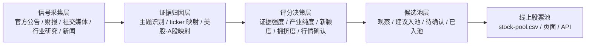
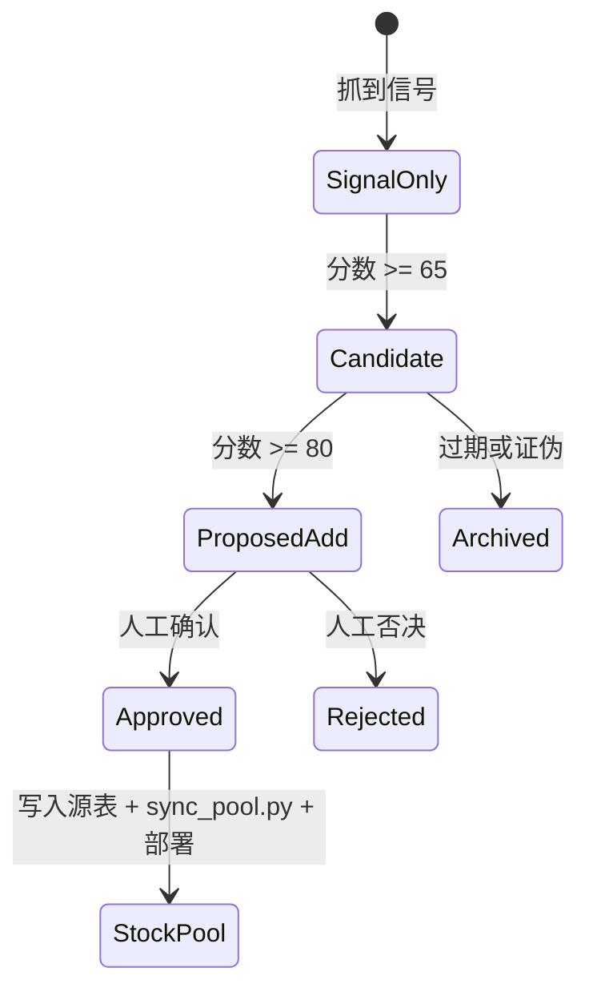

# 主动探索与标的建议系统设计

更新日期：2026-06-23  
适用项目：`/Users/go/Desktop/CodeX/投资分析/股票池信息页`  
目标：把现有“对话驱动更新”的股票池，升级为“主动发现 + 证据打分 + 人工确认 + 入池同步”的研究系统。

## 1. 核心判断

现有系统已经解决了“股票池如何展示”的问题：美股源表、A 股映射源表、合并表、行情接口和线上页面都已经跑通。

下一步要解决的是“股票池如何主动生长”的问题。

我建议不要让系统直接自动买卖，也不要让它直接把社交媒体热度高的股票塞进正式池。更稳的设计是：

> 系统主动探索信号，生成候选方向和候选标的；只有通过证据评分和人工确认后，才进入正式股票池。

这样它会从“记账本”进化成“研究雷达”，但不会变成失控的追热点机器。

## 2. 新系统应该分成四层



四层分别负责：

| 层级 | 作用 | 输出 |
|---|---|---|
| 信号采集层 | 主动抓取外部世界发生了什么 | 原始信号 |
| 证据归因层 | 判断信号属于哪个主题、对应哪些公司 | 主题 + ticker 映射 |
| 评分决策层 | 判断这个信号是否值得跟踪 | 分数 + 推荐动作 |
| 候选池层 | 把建议沉淀成可审核列表 | 候选标的 |

正式股票池仍然是最后一层，不应该被未经验证的信号直接污染。

## 3. 信息源设计

主动探索系统应该按证据强度分层采集，而不是把所有信息源混成一锅粥。加入 arXiv 之后，信息源建议分成四层：一手产业信号、产业链研究、论文前沿信号、社交与市场情绪。

### 3.1 第一层：官方和一手信号

这是最可靠的一层，优先级最高。

| 信息源 | 适合发现什么 |
|---|---|
| NVIDIA Newsroom / Developer Blog / IR | AI factory、Rubin/Blackwell、CPO、Spectrum-X、BlueField、机器人、边缘 AI |
| AMD / Broadcom / Marvell / Intel 官方材料 | 竞争芯片、ASIC、网络芯片、先进封装、CPU/GPU 路线 |
| Microsoft / Amazon / Google / Oracle / Meta IR 和博客 | 云厂商资本开支、数据中心建设、算力需求 |
| Dell / HPE / Lenovo / Supermicro / ASUS / QCT 等系统厂商 | AI 服务器、液冷机柜、整机和机房架构 |
| Coherent / Lumentum / Credo / Arista 等公司公告 | 光通信、CPO、AEC、交换机、SerDes |
| GE Vernova / Vertiv / Eaton 等公司公告 | 电力、配电、液冷、数据中心基础设施 |

这类信号可以作为“入池候选”的核心证据。

### 3.2 第二层：产业链和行业研究

这层用于发现“官方没讲透，但产业链正在发生”的方向。

| 信息源 | 适合发现什么 |
|---|---|
| OCP / OFC / Hot Chips / IEEE / SemiAnalysis 等 | 架构变化、光互联、CPO、封装、网络 |
| 数据中心行业研究 | 液冷、供电、选址、PUE、水资源、并网约束 |
| 半导体设备和材料研究 | 先进制程、HBM、封装、PCB、ABF、MLCC |
| A 股产业链调研和公告 | 国内可交易映射、订单、产能、客户结构 |

这类信号适合生成“观察候选”，但最好要求进一步验证收入、订单或管理层表述。

### 3.3 第三层：arXiv 和 AI 前沿论文

arXiv 应该作为“技术前沿雷达”，用来捕捉模型架构、推理范式、训练方法、系统瓶颈和硬件需求的变化。

它的价值不是直接告诉我们买哪家公司，而是提前回答：

- AI 模型正在变得更吃算力，还是更省算力？
- 推理瓶颈是在 GPU、memory、network、storage，还是电力和散热？
- 新论文是否指向更长上下文、更高推理 token、更大 MoE、更强视频/机器人模型？
- 是否出现会改变供应链需求的技术路径，例如 CPO、KV cache 优化、分布式推理、边缘 agent、机器人 world model？

建议优先监控的 arXiv 分类：

| arXiv 分类 | 关注内容 | 可能映射方向 |
|---|---|---|
| `cs.AI` | 通用人工智能、agent、规划、推理 | 下游应用、agentic AI、算力需求 |
| `cs.LG` | 机器学习、训练算法、模型架构 | GPU、HBM、训练基础设施 |
| `cs.CL` | 大语言模型、RAG、长上下文、推理 | inference、memory、storage |
| `cs.CV` | 视频生成、多模态、视觉模型 | GPU、存储、边缘 AI、机器人 |
| `cs.RO` | 机器人、具身智能、控制 | Physical AI、传感器、执行器 |
| `cs.DC` | 分布式计算、集群系统 | AI 数据中心、网络、调度 |
| `cs.NI` | 网络与互联网架构 | AI networking、交换机、光互联 |
| `cs.AR` | 计算机架构 | GPU/CPU/ASIC、memory hierarchy |
| `cs.PF` | 性能、系统评估 | 推理效率、benchmark、系统瓶颈 |
| `stat.ML` | 统计机器学习 | 模型方法、训练效率 |
| `eess.SP` | 信号处理 | 边缘 AI、传感器、通信 |

建议重点关键词：

```text
agentic AI, reasoning model, mixture of experts, MoE, long context,
KV cache, inference serving, speculative decoding, retrieval augmented generation,
video generation, world model, robotics, embodied AI, multimodal,
distributed training, all-reduce, GPU cluster, AI networking,
optical interconnect, co-packaged optics, silicon photonics,
memory bandwidth, HBM, storage, data center power, liquid cooling
```

arXiv 官方 API 可以通过 `https://export.arxiv.org/api/query` 查询，支持 `search_query`、`start`、`max_results`、`sortBy`、`sortOrder` 等参数；返回格式是 Atom XML。官方文档也说明，同一查询结果按 arXiv 提交流程通常每天更新一次，生产系统应缓存结果，不需要对同一查询频繁请求。  
官方文档：<https://info.arxiv.org/help/api/user-manual.html>

示例查询：

```text
https://export.arxiv.org/api/query?search_query=cat:cs.AI+OR+cat:cs.LG+OR+cat:cs.CL&sortBy=submittedDate&sortOrder=descending&max_results=50
```

更实用的做法是按主题拆分查询，而不是一次抓全量 AI 论文：

```text
cat:cs.LG AND all:"mixture of experts"
cat:cs.CL AND all:"long context"
cat:cs.DC AND all:"inference serving"
cat:cs.NI AND all:"optical interconnect"
cat:cs.RO AND all:"world model"
```

论文信号使用原则：

| 论文信号状态 | 系统动作 |
|---|---|
| 单篇论文提出新方法，但无工程采用 | 只记录为技术观察 |
| 多篇论文集中指向同一瓶颈 | 升级为主题观察 |
| 论文来自 NVIDIA / Google / Meta / Microsoft / Anthropic / Stanford 等高影响主体，且与产业公告一致 | 升级为候选信号 |
| 论文主题已被产品路线、财报 capex 或供应链订单确认 | 可进入“建议入池”评分 |
| 论文结论指向“更省算力”而非“更多算力” | 同时标记为现有算力链风险 |

### 3.4 第四层：社交媒体和市场情绪

社交媒体应该是“早期雷达”，不是“结论来源”。

可以监控：

- X.com / Twitter：产业人士、公司高管、工程师、投资者讨论；
- Reddit：散户关注度、主题发酵、争议点；
- YouTube / 播客：半导体、AI infra、数据中心研究内容；
- Polymarket：对公司事件和宏观事件的押注热度；
- 新闻热度：同一主题是否从小圈子扩散到主流财经媒体。

当前本机社交情绪 API 需要 `ADANOS_API_KEY`，现在环境里还没有配置，所以这层暂时应设计为“可接入模块”。配置后可以对候选 ticker 拉取：

```text
Reddit mentions / buzz_score / bullish_pct / trend
X.com mentions / buzz_score / bullish_pct / trend
News mentions / sentiment / trend
Polymarket trade_count / bullish_pct / trend
```

社交信号使用原则：

| 社交信号状态 | 系统动作 |
|---|---|
| 热度升高，但无一手证据 | 标记为“情绪观察” |
| 热度升高，且有官方/财报确认 | 升级为“候选入池” |
| 热度极高，价格已大幅上涨 | 标记为“拥挤/过热观察” |
| 热度低，但官方证据强 | 可能是更好的早期机会 |

## 4. 系统应该维护四张新表

现有系统有：

- `美股股票池.csv`
- `A股映射股票池.csv`
- `stock-pool.csv`

主动探索系统建议新增四张研究表。

### 4.1 `discovery-signals.csv`

记录每一条外部信号。

建议字段：

| 字段 | 含义 |
|---|---|
| `signal_id` | 信号唯一 ID |
| `date` | 信号日期 |
| `source_type` | official / filing / industry / arxiv / paper / news / social / market |
| `source_name` | 来源名称 |
| `source_url` | 来源链接 |
| `title` | 标题 |
| `summary` | 信号摘要 |
| `theme` | 主题 |
| `tickers_mentioned` | 直接提到的 ticker |
| `mapped_tickers` | 系统推导出的相关 ticker |
| `mapped_a_shares` | 对应 A 股候选 |
| `evidence_strength` | 证据强度 |
| `confidence` | 系统信心 |
| `created_at` | 记录时间 |

### 4.2 `arxiv-papers.csv`

记录系统抓到并筛选后的 arXiv AI 相关论文。

建议字段：

| 字段 | 含义 |
|---|---|
| `arxiv_id` | arXiv 论文 ID |
| `published` | 首次提交日期 |
| `updated` | 最新更新时间 |
| `title` | 论文标题 |
| `authors` | 作者 |
| `primary_category` | 主分类 |
| `categories` | 所有分类 |
| `abstract` | 摘要 |
| `abs_url` | 摘要页 |
| `pdf_url` | PDF 链接 |
| `topic` | 系统识别出的主题 |
| `technical_signal` | 技术信号摘要 |
| `bottleneck` | 指向的瓶颈：compute / memory / network / storage / power / cooling / edge |
| `mapped_themes` | 映射到的投资主题 |
| `mapped_tickers` | 映射到的美股 ticker |
| `mapped_a_shares` | 映射到的 A 股标的 |
| `paper_signal_score` | 论文信号分 |
| `investment_readthrough` | 投资映射说明 |
| `risk_note` | 风险和反向含义 |

这张表不是正式股票池，只是“技术雷达缓存”。同一篇论文可以映射到多个主题，但只有在产业证据或行情证据进一步确认后，才进入 `discovery-candidates.csv`。

### 4.3 `discovery-candidates.csv`

记录系统建议跟踪的候选标的。

建议字段：

| 字段 | 含义 |
|---|---|
| `ticker` | 股票代码 |
| `company` | 公司名 |
| `market` | 美股 / A 股 |
| `theme` | 所属主题 |
| `chain_layer` | 上游 / 中游 / 下游 |
| `mapped_us` | A 股映射的美股锚点 |
| `why_now` | 为什么现在值得看 |
| `source_strength_score` | 来源强度分 |
| `exposure_purity_score` | 产业纯度分 |
| `paper_signal_score` | arXiv / 论文前沿信号分 |
| `novelty_score` | 新颖度分 |
| `sentiment_score` | 社交/新闻热度分 |
| `market_setup_score` | 行情位置分 |
| `supporting_papers` | 支撑论文 ID 列表 |
| `risk_score` | 风险分 |
| `total_score` | 总分 |
| `recommendation` | observe / propose_add / reject / already_in_pool |
| `review_status` | pending / approved / rejected |
| `notes` | 备注 |

### 4.4 `mapping-aliases.json`

把主题词映射到美股锚点。

这张配置表要和现有 `A股映射股票池.csv` 的 `source_us` 字段配合使用：`source_us` 继续保留人工写入的美股锚点或主题词，`mapping-aliases.json` 负责把宽主题翻译成可连线、可打分的具体美股 ticker。

示例：

```json
{
  "Cloud hyperscalers": ["MSFT", "AMZN", "GOOG", "ORCL", "META"],
  "Vera Rubin": ["NVDA", "DELL", "HPE", "VRT", "ANET", "MRVL", "CRDO"],
  "Spectrum-X Photonics": ["NVDA", "ANET", "MRVL", "COHR", "LITE", "CRDO"],
  "Liquid cooling": ["VRT", "ETN", "DELL"],
  "AI data center power": ["VRT", "ETN", "GEV", "BE", "FLNC", "CVX", "LNG"],
  "HBM and storage": ["MU", "WDC", "STX", "SNDK"],
  "Physical AI": ["NVDA", "TSLA"]
}
```

现在 `app.js` 里有少量别名，未来最好抽出成这个配置文件，供前端图谱和主动探索引擎共同使用。

## 5. 信号评分模型

建议总分 100 分，不用一开始太复杂。核心是可解释。

| 维度 | 权重 | 说明 |
|---|---:|---|
| 来源强度 | 20 | 官方公告、财报、客户订单、产品发布优先 |
| 产业纯度 | 15 | 收入是否真的来自该主题，而不是概念蹭边 |
| 论文前沿信号 | 15 | arXiv 论文是否集中指向新瓶颈或新架构 |
| 时效和新颖度 | 10 | 是否是近期新信号，还是已被市场交易很久 |
| 财务确认 | 15 | 收入、订单、毛利、backlog、capex 是否开始体现 |
| 市场位置 | 10 | 是否已过热、是否刚启动、成交是否放大 |
| 社交/新闻扩散 | 10 | 热度变化和跨平台一致性 |
| 映射风险 | 5 | 尤其 A 股是否只是概念映射 |

推荐动作：

| 总分 | 动作 |
|---:|---|
| 80-100 | 建议入池，进入人工确认 |
| 65-79 | 观察候选，进入候选池 |
| 50-64 | 只记录信号，不入候选池 |
| 0-49 | 忽略或标记噪音 |

但要加两条硬规则：

1. 如果只有社交热度、没有产业证据，最高只能是“观察候选”。
2. 如果 A 股映射没有业务或财务确认，不能标为“高置信”，只能标为“主题代理”。
3. 如果只有单篇 arXiv 论文、没有产业采用迹象，最高只能是“技术观察”，不能直接建议入正式股票池。

### 5.1 从 arXiv 论文到投资信号的翻译规则

arXiv 论文进入系统后，不直接生成买入建议，而是先做“技术瓶颈翻译”。

| 论文主题 | 先翻译成 | 再映射到 |
|---|---|---|
| MoE、agentic reasoning、长链推理 | 推理 token 增长、通信和调度压力 | GPU、HBM、网络、云厂商 capex |
| long context、RAG、KV cache | memory 和 storage 压力 | HBM、SSD、存储系统、数据库 |
| video generation、world model | 训练和推理算力密度提升 | GPU、服务器、液冷、电力 |
| distributed inference、serving optimization | 集群网络和调度瓶颈 | 交换机、AEC、光模块、SerDes |
| robotics、embodied AI | 端侧推理、传感器、执行器 | Physical AI、机器人、传感器、小金属 |
| optical interconnect、silicon photonics、CPO | 光互联路线提前 | 光模块、光器件、DSP、交换芯片 |
| efficient inference、model compression | 单位 token 成本下降 | 算力链风险，同时利好应用扩散 |

论文信号要进入候选池，至少满足以下任一条件：

1. 同一主题在最近一段时间出现多篇高相关论文；
2. 作者机构来自头部 AI lab、云厂商、芯片厂或系统厂；
3. 论文主题与 NVIDIA / 云厂商 / 系统厂近期产品路线一致；
4. 论文指向的瓶颈已在财报、产品公告或供应链订单中出现；
5. 论文对应方向在行情或社交讨论中开始扩散。

## 6. 推荐的主动探索主题

基于当前 AI 产业链状态和现有股票池，我建议主动探索先从 8 条线开始。

### 6.1 Rubin / Blackwell 到 Vera Rubin 的机柜级升级

信号逻辑：

- NVIDIA Vera Rubin 已进入规模生产叙事；
- rack-scale AI factory 成为主线；
- 系统厂、网络、液冷、电力、存储都被重新拉进价值链。

美股候选：

- 已在池内：`NVDA`、`DELL`、`VRT`、`CLS`、`ANET`、`MRVL`、`CRDO`、`ETN`
- 可探索增补：`HPE`、`SMCI`、`NTAP`、`PSTG`

A 股映射：

- 已有：`601138.SS` 工业富联、`000977.SZ` 浪潮信息、`000938.SZ` 紫光股份
- 可继续观察：服务器电源、液冷、交换机、存储整机相关公司

### 6.2 CPO / 光互联 / 1.6T 和 3.2T 升级

信号逻辑：

- million-GPU AI factory 需要更高效的网络；
- NVIDIA Spectrum-X Ethernet Photonics 和 CPO 强化了光互联的重要性；
- 光模块、光器件、DSP、SerDes、AEC、交换芯片都需要拆开看。

美股候选：

- 已在池内：`COHR`、`LITE`、`FN`、`CIEN`、`GLW`、`MRVL`、`CRDO`、`ANET`
- 可探索增补：`ALAB`、`CSCO`、`NOK`

A 股映射：

- 已有：`300308.SZ` 中际旭创、`300502.SZ` 新易盛、`300394.SZ` 天孚通信、`002281.SZ` 光迅科技、`000988.SZ` 华工科技、`688498.SS` 源杰科技

### 6.3 数据中心电力、液冷和离网供电

信号逻辑：

- AI 基建的瓶颈从 GPU 扩展到电力、冷却、水资源和并网速度；
- 液冷从“可选配置”变成高密度机柜的基本要求；
- 数据中心可能越来越多采用共址电力、燃气、储能、核电等方案。

美股候选：

- 已在池内：`VRT`、`ETN`、`GEV`、`BE`、`FLNC`、`CVX`、`LNG`、`SMR`、`OKLO`
- 可探索增补：`CAT`、`CEG`、`NEE`

A 股映射：

- 已有：`002837.SZ` 英维克、`301018.SZ` 申菱环境、`300870.SZ` 欧陆通、`002851.SZ` 麦格米特、`688676.SS` 金盘科技、`002028.SZ` 思源电气、`600875.SS` 东方电气、`601985.SS` 中国核电
- 待同步候选：`300499.SZ` 高澜股份、`300602.SZ` 飞荣达、`300990.SZ` 同飞股份、`920808.BJ` 曙光数创

### 6.4 HBM / SSD / context memory

信号逻辑：

- agentic AI、长上下文、推理链条增加对 memory 和 storage 的需求；
- 需要同时看 HBM、企业级 SSD、大容量 HDD、存储系统。

美股候选：

- 已在池内：`MU`、`WDC`、`STX`、`SNDK`
- 可探索增补：`NTAP`、`PSTG`

A 股映射：

- 已有：`301308.SZ` 江波龙、`688525.SS` 佰维存储、`001309.SZ` 德明利、`603986.SS` 兆易创新、`000021.SZ` 深科技

### 6.5 高速 PCB / CCL / 封装载板

信号逻辑：

- GPU 机柜、AI 服务器和高速网络提高 PCB 层数、材料和良率要求；
- 这条线经常会被市场交易得很拥挤，需要跟踪订单和价格确认。

美股锚点：

- `NVDA`、`DELL`、`ANET`、`AVGO`、`MRVL`

A 股映射：

- 已有：`002463.SZ` 沪电股份、`300476.SZ` 胜宏科技、`002916.SZ` 深南电路、`600183.SS` 生益科技、`603228.SS` 景旺电子

### 6.6 半导体设备和国产替代

信号逻辑：

- AI 算力受制于先进制程、先进封装、存储和测试；
- A 股设备公司映射更偏国产替代和资本开支周期，不应简单等同于 NVIDIA 供应链。

美股锚点：

- 已在池内：`ASML`、`TSM`、`VECO`、`INTC`
- 可探索增补：`AMAT`、`LRCX`、`KLAC`

A 股映射：

- 已有：`002371.SZ` 北方华创、`688012.SS` 中微公司、`688072.SS` 拓荆科技、`300604.SZ` 长川科技、`688120.SS` 华海清科
- 待同步候选：`002156.SZ` 通富微电

### 6.7 Physical AI / 机器人 / 传感器 / 小金属材料

信号逻辑：

- 如果 AI 从云端推理走向机器人、智能制造和终端设备，执行器、传感器、热管理、稀土、小金属都会成为映射方向；
- 这条线容易概念化，必须把“供应链确认”和“主题代理”分开。

美股锚点：

- 已在池内：`NVDA`、`TSLA`
- 可探索增补：`ISRG`、`TER`、`ROK`

A 股映射：

- 已有：`002050.SZ` 三花智控、`601689.SS` 拓普集团、`300124.SZ` 汇川技术、`688017.SS` 绿的谐波、`688322.SS` 奥比中光
- 待同步候选：`600111.SS` 北方稀土、`000657.SZ` 中钨高新、`000962.SZ` 东方钽业、`002428.SZ` 云南锗业、`300285.SZ` 国瓷材料

### 6.8 国防、无人机、太空和低轨通信

信号逻辑：

- AI、无人系统、卫星通信和国防补库是另一条独立链；
- 与 AI 主线有交叉，但应单独评分，避免混入数据中心 capex 逻辑。

美股候选：

- 已在池内：`RKLB`、`ASTS`、`PL`、`LMT`、`RTX`、`AVAV`

A 股映射：

- 已有：`002179.SZ` 中航光电、`688297.SS` 中无人机、`002389.SZ` 航天彩虹

## 7. 每次主动探索的输出格式

建议系统每天或每周输出一份“主动探索报告”，固定结构如下。

```text
1. 今日/本周最重要的 3-5 个产业信号
2. 每个信号对应的产业链含义
3. arXiv 前沿论文：本周高相关论文、技术瓶颈、投资映射
4. 美股候选标的：已在池内 / 建议新增 / 暂不跟踪
5. A 股映射标的：已在池内 / 建议新增 / 映射风险
6. 社交媒体和新闻热度：是否正在扩散
7. 行情确认：价格、成交量、相对强弱、是否过热
8. 建议动作：
   - 加入候选池
   - 建议入正式股票池
   - 保持观察
   - 剔除/降级
9. 证据链接、论文链接和置信度
```

这样每次输出都可以直接服务于股票池维护，而不是写一篇看完就散的行业文章。

## 8. 和现有线上股票池如何打通

建议新增一个“主动发现”工作流。

### 8.1 后台脚本

新增脚本：

```text
discovery_engine.py
```

职责：

1. 读取当前 `美股股票池.csv`、`A股映射股票池.csv`、`stock-pool.csv`；
2. 抓取外部信号；
3. 拉取 arXiv AI 相关论文并更新 `arxiv-papers.csv`；
4. 识别主题、技术瓶颈和 ticker；
5. 生成 `discovery-signals.csv`；
6. 生成或更新 `discovery-candidates.csv`；
7. 输出一份 Markdown 研究报告。

### 8.2 前端页面

线上页新增一个 tab：

```text
主动发现
```

里面展示：

- 今日新信号；
- 今日/本周高相关 arXiv 论文；
- 推荐方向；
- 候选标的；
- 证据强度；
- 是否已在池内；
- 建议动作；
- 一键复制成源表新增行。

### 8.3 API

可以新增：

```text
/api/discovery
/api/signals
/api/candidates
/api/papers
```

第一版不一定要做复杂数据库，CSV 或 JSON 文件就够。

## 9. 人工确认闸门

主动探索系统不应该绕过人工确认。建议状态流转如下：



对应中文状态：

| 状态 | 含义 |
|---|---|
| `SignalOnly` | 只记录信号，不形成候选 |
| `Candidate` | 观察候选 |
| `ProposedAdd` | 建议入池 |
| `Approved` | 已确认 |
| `Rejected` | 已否决 |
| `StockPool` | 已进入正式股票池 |
| `Archived` | 已过期或证伪 |

## 10. 第一版实现建议

我建议分三期做。

### 第一期：无社交 API 的主动探索 MVP

目标：先让系统主动读官方、新闻和 arXiv 论文信号，生成候选报告。

实现内容：

- 新增 `discovery_engine.py`；
- 新增 `discovery-signals.csv`；
- 新增 `arxiv-papers.csv`；
- 新增 `discovery-candidates.csv`；
- 新增 `mapping-aliases.json`；
- 每次运行生成一份 `reports/discovery-YYYY-MM-DD.md`；
- 不自动修改正式股票池。

优点：

- 风险低；
- 不依赖额外 API key；
- arXiv API 不需要认证，适合先做自动化论文雷达；
- 可以马上和现有股票池打通。

### 第二期：接入社交媒体和情绪数据

目标：让系统知道“市场正在讨论什么”。

需要：

```bash
export ADANOS_API_KEY="..."
```

接入后，系统可以为每个候选 ticker 记录：

- Reddit 热度；
- X.com 热度；
- 新闻热度；
- Polymarket 活跃度；
- bullish / bearish 分歧；
- 是否从小圈层扩散到主流市场。

### 第三期：线上页面展示和半自动入池

目标：把主动发现结果放进线上页面。

实现内容：

- 新增“主动发现”tab；
- 候选标的卡片；
- 证据链接；
- 分数解释；
- “建议加入美股源表 / A 股源表”的可复制行；
- 经你确认后，再运行 `sync_pool.py` 和部署。

## 11. 第一版报告里的候选建议不应怎样做

需要避免三件事：

1. 不要把“社交媒体很热”直接等同于“值得买”。
2. 不要把“A 股概念相关”直接等同于“确定供应商”。
3. 不要为了追求新鲜感，忽略估值、拥挤度和行情位置。

更好的判断是：

```text
强信号 = 一手证据 + 产业链纯度 + 财务确认 + 行情尚未过度拥挤
```

而不是：

```text
强信号 = 网上很多人在说
```

## 12. 示例：一条信号如何转化为候选标的

假设系统读到一条 NVIDIA 关于 Vera Rubin 和 Spectrum-X Ethernet Photonics 的官方信号。

### 12.1 原始信号

```text
NVIDIA Vera Rubin 进入规模生产；
Spectrum-X Ethernet Photonics / CPO 用于 million-GPU AI factories；
生态伙伴包括 Dell、HPE、Lenovo、Supermicro、ASUS、QCT 等。
```

### 12.2 主题识别

```text
主题：Rack-scale AI factory / CPO / AI networking / liquid cooling
```

### 12.3 美股映射

```text
NVDA, DELL, HPE, SMCI, ANET, MRVL, CRDO, COHR, LITE, VRT, ETN
```

### 12.4 A 股映射

```text
工业富联、浪潮信息、紫光股份、中际旭创、新易盛、天孚通信、光迅科技、英维克、申菱环境、金盘科技
```

### 12.5 系统动作

```text
已在池内：更新跟踪理由和证据链接
不在池内：进入 discovery-candidates.csv
社交热度高但无确认：标为“情绪观察”
证据强且未过热：标为“建议入池”
```

## 13. 示例：一批 arXiv 论文如何转化为候选方向

假设系统在最近 7 天里抓到多篇与 `long context`、`KV cache`、`inference serving` 有关的论文。

### 13.1 原始论文信号

```text
多篇论文讨论长上下文推理、KV cache 压缩、分布式 inference serving、speculative decoding。
```

### 13.2 技术瓶颈翻译

```text
主题：长上下文 + agentic inference
瓶颈：HBM 容量、memory bandwidth、GPU 利用率、推理调度、SSD/存储吞吐
```

### 13.3 美股映射

```text
NVDA, AMD, AVGO, MRVL, MU, WDC, STX, SNDK, DELL, CRWV, NBIS, ORCL, MSFT, AMZN, GOOG
```

### 13.4 A 股映射

```text
兆易创新、江波龙、佰维存储、德明利、深科技、工业富联、浪潮信息、紫光股份
```

### 13.5 系统动作

```text
论文密集但无商业确认：技术观察
论文主题与云厂商 capex / NVIDIA 产品路线一致：候选信号
论文主题已被财报或订单验证：建议入候选池
如果论文方向指向显著降本：同时标记为现有算力链风险
```

### 13.6 建议 arXiv 查询模板

第一版可以先固定 8 组查询：

```text
cat:cs.CL AND all:"long context"
cat:cs.CL AND all:"KV cache"
cat:cs.LG AND all:"mixture of experts"
cat:cs.LG AND all:"speculative decoding"
cat:cs.DC AND all:"inference serving"
cat:cs.NI AND all:"optical interconnect"
cat:cs.RO AND all:"world model"
cat:cs.AR AND all:"memory bandwidth"
```

每组查询按 `submittedDate` 倒序取最近 30-50 篇，再由系统按标题、摘要、分类和作者机构做二次过滤。

## 14. 用到的当前公开信号示例

这些不是唯一来源，只是说明系统应该如何把公开信号转为主题方向。

1. NVIDIA 2026-05-31 宣布 Vera Rubin 正在进入规模生产，并提到台湾系统厂和全球供应链伙伴在量产 Vera Rubin 系统；同一公告还提到 Spectrum-X Ethernet Photonics / CPO 已进入生产，用于 million-GPU AI factories。  
   来源：<https://nvidianews.nvidia.com/news/vera-rubin-full-production-agentic-ai-factory>

2. NVIDIA Rubin 平台官方材料强调 agentic AI、reasoning、MoE 推理、NVLink、Vera CPU、Rubin GPU、Confidential Computing 等架构升级，并引用 Microsoft、AWS、Google、Oracle、Dell、HPE、Lenovo 等生态伙伴表态。  
   来源：<https://nvidianews.nvidia.com/news/rubin-platform-ai-supercomputer>

3. Microsoft 2026 年关于 AI 基础设施的文章把 AI infrastructure 描述为新的基础设施周期，并明确提到土地、建设、电力、液冷、高带宽连接和运营等投入。  
   来源：<https://blogs.microsoft.com/on-the-issues/2026/01/13/community-first-ai-infrastructure/>

4. Dell 2026 年 AI Factory with NVIDIA 公告给出了多个 Blackwell / GB300 / PowerEdge / PowerSwitch / Quantum-X800 相关产品和上市节奏，说明企业 AI 基础设施正在从芯片扩散到整机、网络和服务。  
   来源：<https://www.dell.com/en-us/dt/corporate/newsroom/announcements/detailpage.press-releases~usa~2026~03~dell-ai-factory-with-nvidia-delivers-proven-path-to-enterprise-ai-roi.htm>

5. ASUS 2026 年发布基于 NVIDIA Vera Rubin NVL72 的液冷 AI POD，强调 rack-scale、全液冷、降低 PUE/TCO，说明液冷基础设施正在成为高密度 AI 工厂的重要方向。  
   来源：<https://press.asus.com/news/press-releases/asus-ai-pod-nvidia-vera-rubin-nvl72/>

6. arXiv 官方 API 支持通过 `search_query`、`submittedDate`、`sortBy`、`sortOrder` 等方式拉取论文元数据，返回 Atom XML；生产系统应缓存同一查询结果，避免重复高频请求。  
   来源：<https://info.arxiv.org/help/api/user-manual.html>

## 15. 我建议的下一步

如果要开始落地，我建议先做第一期 MVP：

1. 新建 `discovery_engine.py`；
2. 新建 `mapping-aliases.json`；
3. 新建 `arxiv-papers.csv`；
4. 新建 `discovery-signals.csv` 和 `discovery-candidates.csv`；
5. 先跑“官方信号 + arXiv 论文 + 新闻信号 + 当前股票池 + 行情位置”的主动探索；
6. 每次输出候选建议，但不自动入池；
7. 你确认后，再把标的写入 `美股股票池.csv` 或 `A股映射股票池.csv`。

这会让系统开始主动提出：

```text
今天发现了哪些新方向？
哪些已在池内需要提高关注？
哪些不在池内但值得加入候选？
哪些只是社交热点、暂不可信？
哪些 A 股映射过热，需要谨慎？
```

也就是从“你问我更新”变成“系统先侦察，我和你一起审核”。
