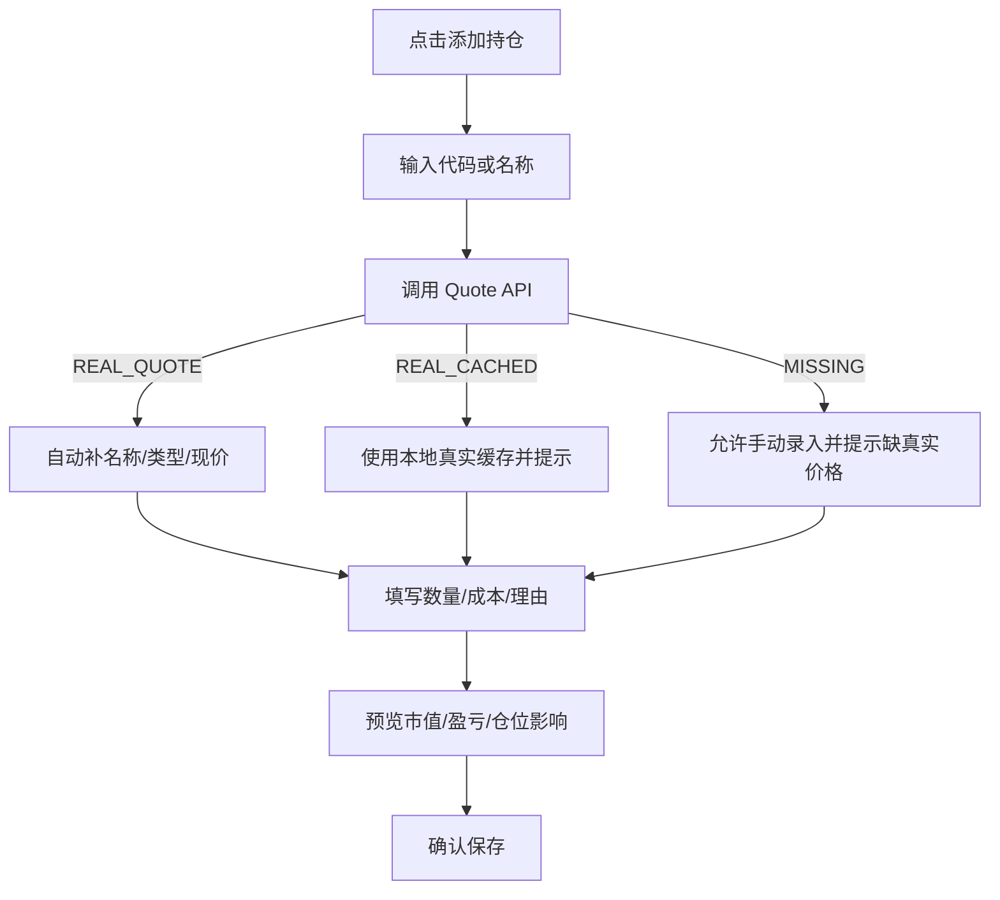

# PORT-001: 持仓录入体验重构

- Status: DONE
- Priority: P0
- Owner: Codex
- Created At: 2026-06-21
- Depends On: QUOTE-001

## Goal

把添加持仓从全手工表单升级为“资产识别 -> 自动补价 -> 用户确认”的低摩擦流程。用户不应再被迫手工填写名称、资产类型和现价。

## Why

当前持仓录入把新增持仓、更新现价、修正成本和记录买入理由混在一个表单里。用户需要手动输入代码、名称、资产类型、数量、成本价和现价，容易输错，也容易把手动价格误当成真实行情。

核心矛盾：

- 用户希望快速录入当前持仓。
- 系统需要保证价格来源真实且可解释。
- 当前数据模型只有 `portfolio_position` 快照，还没有交易流水。

## Scope

- 重构 `PortfolioPage` 的添加/编辑表单。
- 输入 symbol 后自动调用 `QUOTE-001` 报价接口。
- 自动填充 name、asset_type、current_price、price source、price date/time。
- 用户主要填写 quantity、avg_cost、buy_reason、stop_loss_price、take_profit_price。
- 保存前展示预估市值、浮盈亏、仓位影响和数据来源。
- 如果报价接口不可用，允许手动继续，但必须明确显示“手动价格 / 仅用于临时估算”。

## Out of Scope

- 不新增交易流水表。
- 不实现买入/卖出/加仓/减仓历史。
- 不做券商导入。
- 不做批量 CSV 导入。
- 不自动执行每日任务。
- 不把用户手动输入现价写成真实行情源。

## UX Flow



## Concrete Changes

### 1. Form Structure

Change current flat form into sections:

```text
1. 资产
   - symbol input
   - name / asset_type auto-filled
   - quote status badge

2. 持仓
   - quantity
   - avg_cost
   - current_price auto-filled by default
   - manual override warning if edited

3. 风险与理由
   - stop_loss_price
   - take_profit_price
   - buy_reason

4. 保存前预览
   - market value
   - unrealized pnl
   - estimated portfolio weight impact
   - price source and data date
```

### 2. Quote Integration

- Debounce symbol input or query on blur/button.
- Display loading, success, cached and missing states.
- Keep user-entered quantity/cost when quote refreshes.
- Do not block saving solely because realtime quote fails.

### 3. Save Behavior

- Preserve existing `POST /api/portfolio/positions` contract if possible.
- Send normalized symbol, name, asset_type, quantity, avg_cost and current_price.
- Include current price only as portfolio snapshot price, not as market data source.
- Existing overwrite behavior must be explicit in UI: “将更新当前持仓快照”。

### 4. Empty/Error States

- Unknown symbol: show `真实报价缺失，可手动录入，但不会作为真实行情源`.
- Duplicate symbol: show `该资产已有持仓，本次保存将更新当前快照`.
- Quote cached: show `使用真实历史缓存，不代表盘中实时价格`.

## Acceptance

- 添加持仓时，用户输入 `600519.SH` 后能自动填充名称、类型和价格信息。
- 用户只需要填写数量、平均成本和可选风险/理由字段即可保存。
- 保存前能看到预估市值、浮盈亏和仓位影响。
- 实时源失败时，能降级使用真实缓存或手动录入，并明确提示边界。
- 手动价格不会被标记为真实行情数据。
- 已有持仓更新前有明确提示，不静默覆盖。
- 前端 build 通过。

## Verification

Suggested commands:

```bash
pnpm -C frontend build
uv run python -m compileall backend/app worker scripts
git diff --check
```

Suggested UI smoke:

- 输入可识别 A股，确认自动补字段。
- 输入可识别 ETF，确认自动补字段。
- 输入基金代码，确认使用本地最新净值或缺失态。
- 输入未知代码，确认可以手动继续且警告明显。
- 添加已存在持仓，确认覆盖提示可见。

## Notes

本任务先改善当前快照录入体验。交易流水、批量导入和券商导入应作为后续任务独立设计，避免一次性把持仓模块做复杂。

## Completion

- Completed At: 2026-06-21
- Changed Files: `frontend/src/pages/PortfolioPage.tsx`, `frontend/src/api/types.ts`, `frontend/src/styles/global.css`
- Verification: frontend `tsc --noEmit`; frontend `vite build`; `uv run python -m compileall backend/app worker scripts`; `git diff --check`.
- Notes: Portfolio form now follows asset recognition -> quote lookup -> user confirmation. Manual price remains allowed only as portfolio snapshot estimate and is clearly labeled.
