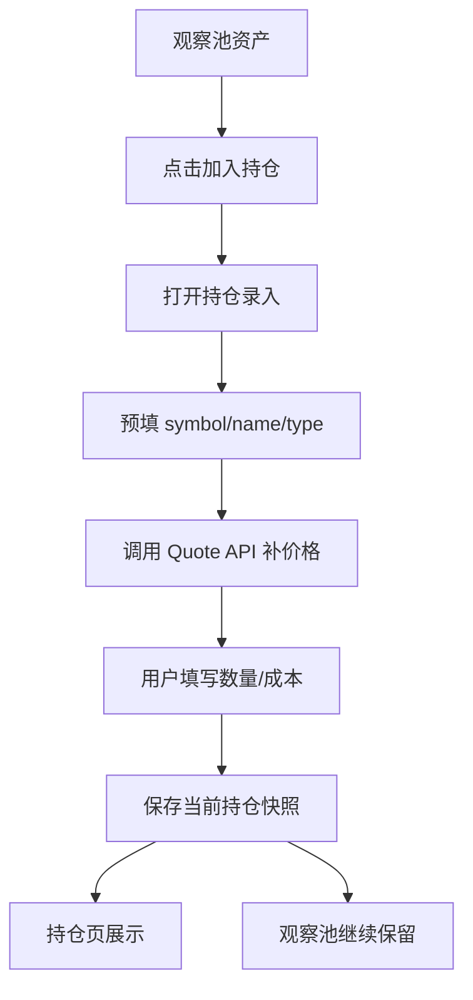

# PORT-002: 观察池一键加入持仓

- Status: TODO
- Priority: P0
- Owner: Codex
- Created At: 2026-06-21
- Depends On: QUOTE-001, PORT-001

## Goal

打通“观察 -> 买入 -> 持仓”的低摩擦链路。观察池资产应能一键进入持仓录入流程，并自动带入资产信息、报价和研究上下文。

## Why

当前观察池和持仓页是割裂的。用户在观察池看到某个资产值得买入后，还需要去持仓页重新手动输入代码、名称、类型、价格、理由。这破坏了投资研究闭环，也增加录入错误概率。

核心矛盾：

- 观察池已经承载研究状态和建议。
- 持仓录入需要资产基础信息和买入理由。
- 当前没有从观察池到持仓的动作入口。

## Scope

- 在观察池资产卡片或列表行新增“加入持仓”动作。
- 点击后跳转到持仓页或打开持仓录入弹窗。
- 预填 symbol、name、asset_type。
- 调用 QUOTE-001 获取 latest price / NAV。
- 带入观察池建议状态、研究状态和用户备注，作为默认买入理由参考。
- 保存后持仓页展示新持仓，观察池资产继续保留。

## Out of Scope

- 不自动买入。
- 不接券商下单。
- 不自动删除观察池资产。
- 不新增交易流水。
- 不自动执行每日任务。
- 不把观察池建议当成强制买入依据。

## UX Flow



## Concrete Changes

### 1. Watchlist Entry Action

- Add action button: `加入持仓`.
- Button should be visible but not dominant over research state.
- Disabled or warning state if asset lacks valid symbol.

### 2. Navigation / State Passing

Choose one implementation:

```text
Option A: App-level navigation state
  onNavigate('portfolio', { prefillPosition: asset })

Option B: Query/hash state
  portfolio?symbol=600519.SH&action=add

Option C: Shared modal state if layout supports it
```

First version should prefer simplest maintainable path.

### 3. Portfolio Prefill

When entering from watchlist:

- prefill symbol, name, asset_type.
- trigger quote lookup.
- prefill buy_reason with a short context such as:

```text
来自观察池：{research_state}；当前建议：{advice}；备注：{note}
```

### 4. Save Semantics

- Saving creates or updates `portfolio_position` through existing API.
- The watchlist item remains unchanged.
- After saving, show success and keep user on Portfolio page.

## Acceptance

- 观察池资产有“加入持仓”入口。
- 点击后能进入持仓录入流程并预填 symbol/name/asset_type。
- 持仓录入能自动查询报价或显示缓存/缺失状态。
- 默认买入理由能带入观察池上下文。
- 保存后持仓列表出现对应资产。
- 观察池资产不会被自动删除。
- 前端 build 通过。

## Verification

Suggested commands:

```bash
pnpm -C frontend build
uv run python -m compileall backend/app worker scripts
git diff --check
```

Suggested UI smoke:

- 从观察池股票加入持仓。
- 从观察池 ETF 加入持仓。
- 从观察池基金加入持仓。
- 报价成功、报价缓存、报价缺失三种状态都能继续正确处理。
- 保存后观察池记录仍存在。

## Notes

本任务是用户路径优化，不改变投资建议规则。观察池建议只能作为录入上下文，不应自动触发买入或生成强制交易动作。
