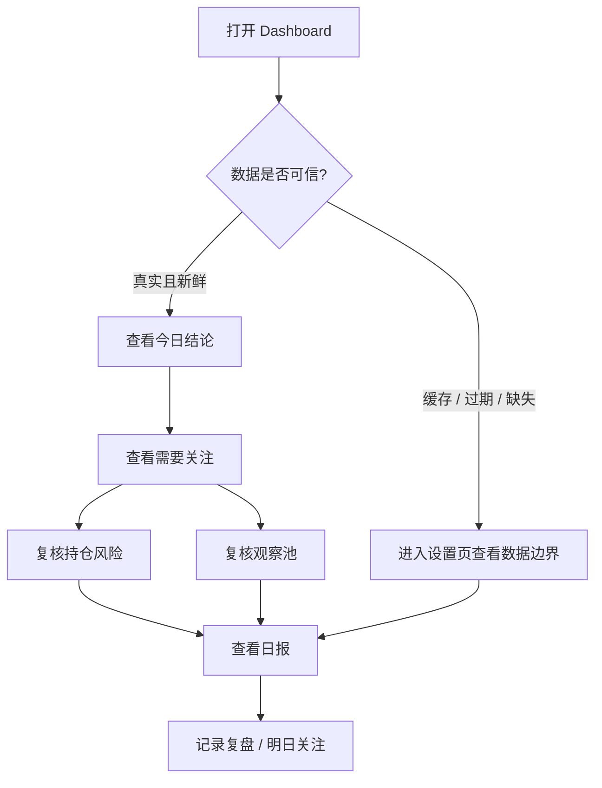
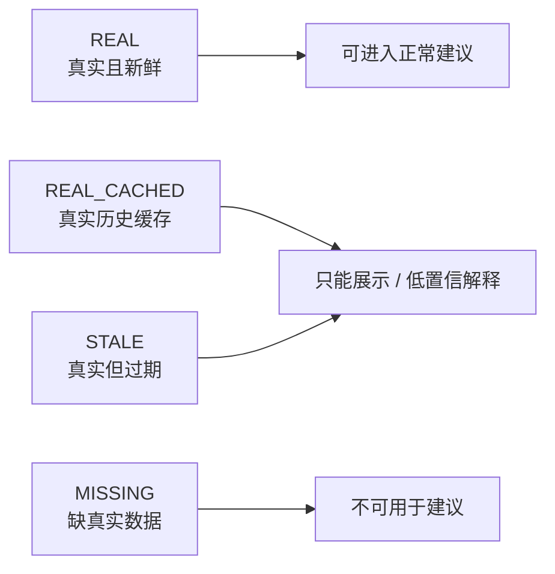

# 用户使用手册

本文面向使用者，说明每天应该怎么看页面、怎么录入资产、怎么判断数据是否可信，以及如何形成复盘闭环。

## 一句话流程

```text
先看 Dashboard 判断今天是否需要行动；
再看持仓和观察池确认优先级；
最后用日报和复盘记录决策结果。
```

## 每日使用流程



## 页面怎么用

### 1. Dashboard：今日工作台

Dashboard 是每天的第一入口。

重点看：

| 区块 | 用途 | 判断方式 |
|---|---|---|
| 数据状态 | 判断今天数据能不能支撑建议 | 优先确认是否 `REAL` / `FRESH` |
| 今日结论 | 快速理解市场、组合和风险状态 | 看是否需要人工复核 |
| 需要关注 | 找出今天最该处理的资产或风险 | 优先处理高风险、缺数据、仓位集中项 |
| 明日关注 | 明确下一步观察事项 | 作为复盘和次日检查入口 |
| 下钻入口 | 跳转到观察、持仓、复盘、日报、设置 | 按问题进入对应页面 |

边界：Dashboard 不是下单页面，只是把系统已经计算出的结论和风险前置。

### 2. 设置页：数据可信度

当页面出现缺失、缓存、过期或不可驱动建议时，优先进入设置页。

重点看：

| 字段 | 含义 |
|---|---|
| 数据集 | `daily_bar`、`fund_nav` 等模块 |
| 最新数据日期 | 当前数据实际覆盖到哪一天 |
| 预期交易日 | 系统按交易日估算的应有日期 |
| 新鲜度 | `FRESH` / `STALE` / `MISSING` |
| 数据来源 | 当前来自真实源、真实缓存还是缺失 |
| 是否可驱动建议 | false 时只能作为展示或低置信解释 |
| warning | 具体降级原因 |

使用原则：

- `REAL + FRESH`：可作为正常分析依据。
- `REAL_CACHED` / `akshare_cached`：真实历史数据，可以展示，但不能驱动高置信当日建议。
- `MISSING`：缺真实数据，页面结论必须降级。

### 3. 观察池

观察池用于管理“可能要研究，但不一定持有”的资产。

典型使用：

1. 添加股票、ETF 或基金。
2. 按研究状态查看：重点研究、数据待补齐、低优先级、关注失效。
3. 对重点资产进入股票页或基金页做深入分析。
4. 过期或失效资产及时移出，避免观察池膨胀。

边界：观察池不是买入清单，它只是研究队列。

### 4. 持仓页

持仓页用于管理已经持有的资产和组合风险。

重点看：

| 区块 | 用途 |
|---|---|
| 组合决策结论 | 当前组合是否需要复核 |
| 最大风险 | 识别主要风险来源 |
| 优先复核持仓 | 优先看仓位过重、亏损过大或建议降级资产 |
| 集中度状态 | 判断是否过度押注单一资产或类型 |
| 资产类型暴露 | 看股票、ETF、基金的分布 |

边界：持仓页不自动计算税费、交易滑点或券商账户真实余额。

### 5. 股票研究

股票页首屏优先看“研究结论”。

结论由以下维度支撑：

- 趋势。
- 估值。
- 财务和质量。
- 行业环境。
- 风险边界。
- 数据日期和来源。

使用原则：

```text
先看结论，再看证据；
先看风险，再看收益；
先看数据可信度，再看建议等级。
```

### 6. 基金 / ETF 研究

基金页用于看基金净值、收益、回撤、波动和深度画像。ETF 会额外关注跟踪指数、流动性、折溢价和跟踪质量。

边界：

- 场外基金不套用股票财报和公司估值。
- ETF 不按公司基本面分析。
- 缺真实源时页面应显示缺失，而不是补假画像。

### 7. 策略信号与策略配置

策略信号用于展示系统根据规则产生的观察、风险和建议状态。策略配置用于调整阈值。

使用建议：

- 普通使用时不要频繁改阈值。
- 改阈值后应结合回测和复盘观察结果。
- 信号只能辅助判断，不是自动交易指令。

### 8. 回测

回测用于观察策略在历史数据上的表现。

边界：

- 第一版是观察池基础回测，不是专业量化回测引擎。
- 回测不能证明未来收益。
- 数据缺失或缓存状态会影响回测可信度。

### 9. 复盘

复盘页用于记录“为什么做这个判断”和“后续结果如何”。

推荐记录：

| 内容 | 例子 |
|---|---|
| 决策 | 继续观察 / 减仓关注 / 移出观察池 |
| 依据 | 趋势转弱、数据缺失、风险集中 |
| 风险 | 数据非新鲜、仓位过重、行业转弱 |
| 结果 | 一周后复核，验证判断是否有效 |

### 10. 日报

日报页面先看“今日投资简报”，再看 Markdown 原文。

重点看：

- 最重要变化。
- 是否需要复核。
- 明日先看。
- 数据边界。
- 股票 / 基金 / ETF 分区摘要。

## 数据可信度怎么理解



不要把 `REAL_CACHED` 当成 sample。它是历史真实数据，但不是当前最新数据。

## 推荐每日检查清单

```text
1. Dashboard：数据状态是否可信？
2. Dashboard：今天是否有需要关注？
3. 持仓：最大风险是否变化？
4. 观察池：是否有重点研究或数据待补齐资产？
5. 日报：今天最重要变化是什么？
6. 复盘：是否需要记录或关闭任务？
```

## 常见误区

| 误区 | 正确理解 |
|---|---|
| Dashboard 结论等于买卖指令 | 不是，只是研究结论和风险提示 |
| 缺数据时可以用估算补上 | 不可以，系统执行 real-only 策略 |
| 真实历史缓存可以驱动今天建议 | 不可以，只能低置信展示 |
| 观察池就是买入清单 | 不是，观察池只是研究队列 |
| 回测好就能保证未来收益 | 不能，回测只用于验证历史表现 |
